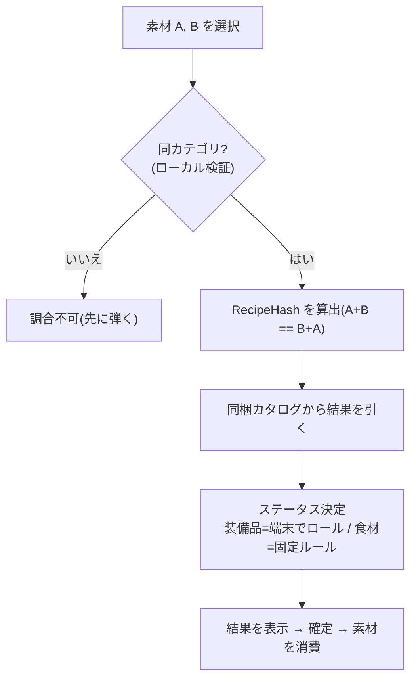
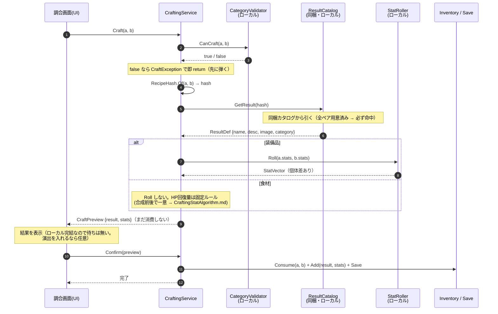

# 調合システム アーキテクチャ

2つの素材を合成して新しいアイテムを作る。

- **ステータス** … **装備品は実行時に式でロール**(端末・個体差あり)。**食材はHP即時回復のみで固定ルール**(合成前後で一意に決まる。ロールもデータ保存も不要。正本 → [CraftingStatAlgorithm.md](./CraftingStatAlgorithm.md) 「食材の固定ルール」)
- **素材(合成前)** … **ベースは決め打ちで固定: 食材10種 + 装備品15種 = 計25種**。名前・画像・説明とも同梱
- **結果(合成後)** … 名前・説明・画像を**事前生成してゲームに同梱**(local)。ステータスはデータに持たない(装備品は端末でロール、食材は固定ルールでその都度決まる)

---

## 全体像

```
【実行時：ゲーム(調合場所)・完全ローカル】
  A,B を選択 →(カテゴリ検証)→ RecipeHash を算出
     → 同梱カタログから結果(名前・説明・画像)を引く
     → ステータスを決定(装備品=端末でロール / 食材=固定ルール)
     → 結果を表示 → 確定 → 素材を消費
```

実行時に生成はしない(結果は事前生成・同梱済み)。有効なペアは全て用意済みなので **必ず結果がある**。ネット接続は一切不要。



---

## 関数レベルのフロー

**入口は `ICraftingService` の2関数だけ**。UI（調合画面）はこの2つしか知らない。内部の協力者（検証・ハッシュ・カタログ解決・ロール・インベントリ）は全部その裏に隠す。

**計算と確定を分ける**のが要点：
- `Craft` … 結果を**プレビューするだけ**。全てローカルなので**同期**でよい（CDN取得が無くなったため `async` 不要）。ここでは**状態を一切変えない**（素材は減らない・セーブしない）。
- `Confirm` … プレビューを**確定**。ここで初めて素材消費・結果付与・セーブが起きる（＝トランザクション境界）。ユーザーが結果を見てキャンセルできる余地を残すため。



---