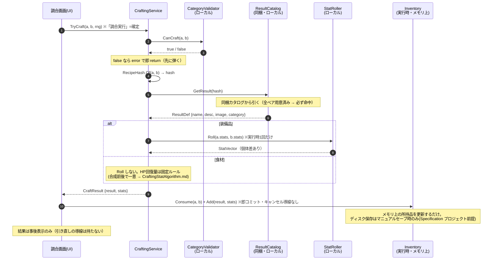

# 調合システム アーキテクチャ

2つの素材を合成して新しいアイテムを作る。

- **実行場所** … **調合場所(フィールド上の固定地点)でのみ実行可能**。それ以外の場所では調合UIを開けない
- **対応カテゴリ** … **装備品同士 / 食材同士** のみ(カテゴリを跨いだ調合は不可・**武器は調合不可**)
- **ステータス** … **装備品は実行時に式でロール**(端末・個体差あり)。**食材はHP即時回復のみで固定ルール**(合成前後で一意に決まる。ロールもデータ保存も不要)。
- **素材(合成前)** … **ベースは決め打ちで固定: 食材10種 + 装備品15種 = 計25種**。名前・画像・説明とも同梱
- **結果(合成後)** … 名前・説明・画像を**事前生成してゲームに同梱**(local)。ステータスはデータに持たない(装備品は端末でロール、食材は固定ルールでその都度決まる)

---

## 全体像

```
【実行時：ゲーム(調合場所)・完全ローカル】
  A,B を選択 → 調合実行(=確定。キャンセル不可)
     →(カテゴリ検証)→ RecipeHash を算出
     → 同梱カタログから結果(名前・説明・画像)を引く
     → ステータスを決定(装備品=端末でロール / 食材=固定ルール)
     → 素材を消費し結果を付与(原子的)→ 結果を事後表示
```

実行時に生成はしない(結果は事前生成・同梱済み)。有効なペアは全て用意済みなので **必ず結果がある**。ネット接続は一切不要。

---

## 関数レベルのフロー

**入口は1関数(`TryCraft`)**。UI（調合画面）はこれだけを知る。内部の協力者（検証・ハッシュ・カタログ解決・ロール・インベントリ）は全部その裏に隠す。

**実行＝確定の単発。ロール結果を見てからのキャンセルは設けない**（**リロールスカミング防止**：装備品は確率ロールなので、キャンセル→再実行を許すと最高値が出るまで粘れてしまい「個体差」が無意味になる)。
- 「調合するか否か」は**素材を選ぶ段で決める**。実行を押した時点で **検証 → ロール → 素材消費 → 結果付与 を一括成立**（トランザクション境界＝途中でキャンセルできる中間状態を作らない）。
- **ロールは実行時に1回だけ**。結果は**事後表示**する(演出は任意)が、その結果を破棄して引き直す導線は**持たない**。
- コード契約：`CraftingService.TryCraft` は検証＋ロールを返すだけ(消費・付与は呼び出し側)。呼び出し側は成功時に**即コミットし、プレビュー段でのキャンセルUIを作らない**。

> **セーブ(ディスク保存)は調合では起こさない。** Confirm が変えるのは**実行時インベントリ(メモリ上)だけ**で、ディスクへ書き込まない。永続化は**マニュアルセーブのみ**で、`Inventory` はセーブ時に全書きする。調合が勝手にセーブすると「オートセーブなし」の前提を破るため、ここでは分離する。



---