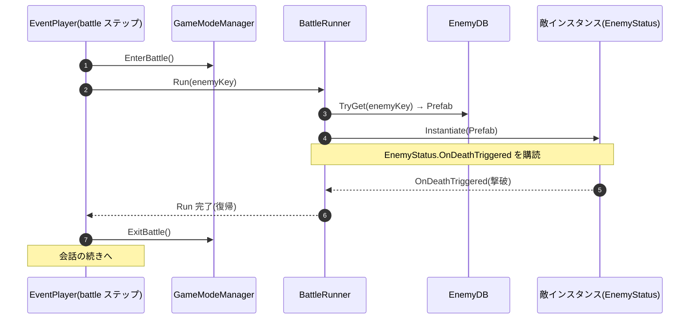

# 敵の実装(手順とフロー)

敵を Unity 上でどう作り、`events.json` の `battle` ステップに書く `enemyKey`(→ [CharactersAndEvents.md](./CharactersAndEvents.md))とどう繋ぐか。敵の **仕様**(雑魚なし・中ボス以上のみ・1戦闘につき1体 等)は [Specification.md](./Specification.md)「プロジェクト前提」。

---

## 1. 敵を作って登録する(Unity Editor でやること)

物語班が書くのは **キー文字列だけ**(例 `{ "kind": "battle", "enemyKey": "wolf_boss" }`)。それを敵 Prefab に結びつけるのがこの節の作業。**`EnemyDB` 1枚に「`enemyKey` → Prefab」の行を並べるだけ**。

**① 敵 Prefab を作る**
- モデル(`.fbx`)+ マテリアル + アニメ + 挙動 + **`EnemyStatus`** を1つの Prefab に合成し、Project に置く
- **ステータス・見た目・挙動はすべて Prefab 側が持つ**(`EnemyStatus` が `EnemyParameterData` を参照)。`EnemyDB` にはキーと Prefab しか持たせない

**② `EnemyDB` に登録する**
- `EnemyDB` アセットは **`Assets/Resources/EnemyDB.asset` に作成済み**(空)。実行時に `enemyKey → Prefab` を引くための唯一のアセット。
- `EnemyDB` を選択 → Inspector のリストの **「＋」で行を1つ足す**。その行に:
  - **`Enemy Key`**:`wolf_boss` などを**キーボードで入力**
  - **`Prefab`**:①の Prefab を欄に **ドラッグ&ドロップ**
- ドラッグした Prefab は GUID で保持されるので、あとでリネーム・移動しても参照は切れない

**③ `enemyKey` を物語班へ共有**
- `EnemyDB` に並べた `enemyKey` 一覧を渡す(手書きの打ち間違い対策)。物語班は `events.json` の `battle` ステップに書くだけ → Import 時に照合される(**存在しない `enemyKey` は Importer が弾く**)

### 確認(Play)
- `battle` ステップのあるイベントを踏む → その敵が **1体**出る
- 倒すとイベント(会話)が **続く**
- 未作成の `enemyKey` でも **クラッシュせず警告スキップ**(会話は続行)

---

## 2. 関数レベルのフロー(BattleRunner)

`enemyKey` を受け取り **敵を出す → 撃破まで待つ → イベントに制御を返す** のが `BattleRunner`(`IBattleRunner` 実体。`_Project/Features/Enemy/Scripts/BattleRunner.cs`)。

