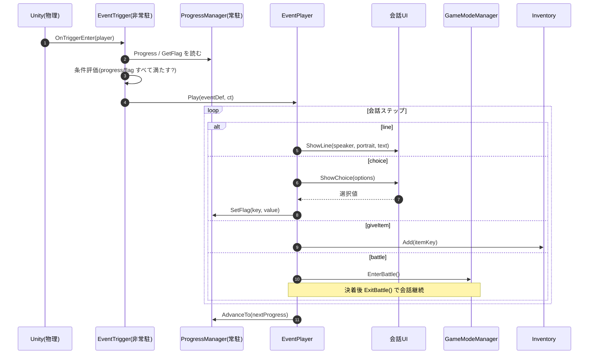

# イベント発火の実装(手順とフロー)

進行管理の **仕様**(進行度・フラグ・`EventDefinition` の中身)は [Specification.md](./Specification.md)「進行管理」。ここでは `events.json` の取り込み〜トリガー設置〜再生の **実装手順とフロー** をまとめる。`events.json` の書式は [CharactersAndEvents.md](./CharactersAndEvents.md)。

---

## パイプライン

```
[events.json]  物語班がテキストエディタで直接記述
   ↓ 取り込み + 検証
[Importer]  Unityエディタ拡張で JSON → EventDefinition(.asset を生成)
   ↓ システム班がシーンのトリガーに .asset をアサイン
[ランタイム]  ProgressManager + EventTrigger が進行度・条件でイベントを発火
```

## EventDefinition の生成・配置・実行

1. **生成** … Importer が `events.json` を検証し、**1イベント = 1つの `.asset`** を出力する(下記 Importer)。
2. **配置** … システム班がシーン上の `EventTrigger` にその `.asset` をアサインする(下記の手順)。
3. **実行** … プレイヤー侵入時に `EventTrigger` が `.asset` の条件を判定し、満たせば `EventPlayer` が中の会話ステップを再生する(下記フロー)。

## シーンへのトリガー設置(システム班の手順)

座標は JSON に書かない。**イベントが起こる場所は、システム班がシーン上に手で置く**。Importer が生成した `EventDefinition`(`.asset`)を、シーン上のトリガーに結び付けて初めて発火する。

| 手順 | やること |
|---|---|
| 1 | フィールドシーンの発火させたい位置に **空の GameObject** を作る |
| 2 | **Collider を付け `Is Trigger = ON`**(プレイヤー侵入を検知する範囲。大きさ・位置でエリアを決める) |
| 3 | **`EventTrigger` をアタッチ** |
| 4 | `EventTrigger` の `[SerializeField] EventDefinition` に、**Importer が生成した `.asset`** をアサイン |
| 5 | プレイヤー側に Rigidbody/レイヤー等、`OnTriggerEnter` が飛ぶ前提を満たす設定を確認 |

- 発火するか(進行度・フラグ条件)は `.asset`(ScriptableObject)側が持つ。トリガーは **場所と範囲だけ**を担当する。
- 1つのイベントを複数箇所で発火させたいなら、同じ `.asset` を複数のトリガーにアサインしてよい。

## 関数レベルのフロー

- `EventTrigger` は Unity がコライダ侵入で叩く。条件を満たせば `EventPlayer.Play()` を呼ぶだけ。
- `EventPlayer` が会話ステップを順に実行し、各ステップで他システム(会話UI・`GameModeManager`・`Inventory`・`ProgressManager`)を叩く。ここが他システムを**指揮する層**(会話→戦闘→会話…)。
- `ProgressManager` は**状態を持つだけ**。進行度・フラグを読ませ／書かせ、変わったら通知する。



## Importer

`events.json` を取り込む Importer はエディタ拡張として `Features/Scenario/` 配下に実装する。必須フィールドは [CharactersAndEvents.md](./CharactersAndEvents.md) のフィールド表を参照。立ち絵・BGM・敵の実キーは手書きなので打ち間違いを前提とし、**存在しないキーは Importer が弾く**。敵キーの解決は [EnemyImplementation.md](./EnemyImplementation.md)。
