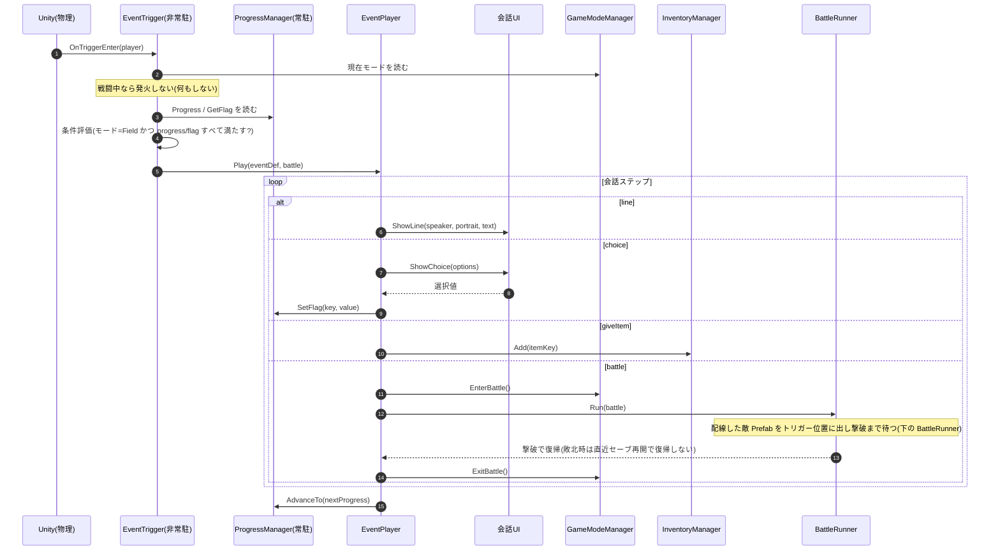
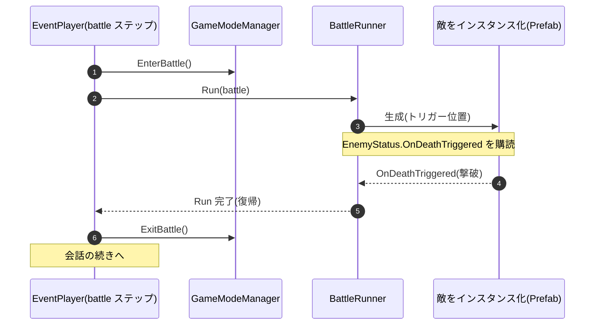

# イベント発火の実装(手順とフロー)

`events.json` の取り込み〜トリガー設置〜再生の **手順**(`battle` ステップで戦う **敵の作成・配置** を含む)。

---

## 1. イベントを取り込んで設置する(Unity Editor でやること)

物語班が書くのは **`events.json` のテキストだけ**。それを取り込み、シーンに置くのがこの節。

**① `events.json` を取り込む**
- 物語班が `events.json` を書く(既定パス `_Project/Features/Scenario/events.json`。
- **`Tools > CreativeAI > Import Events`** を実行 → `_Project/Features/Scenario/Data/Dialogues/{id}.asset` が **1イベント=1 .asset** で生成される。
- **Importer が弾くもの**(打ち間違い対策):必須フィールド欠落・id 重複・未知の `type`/`kind`・`battle` 位置制約(先頭/末尾は line)・**`battle` は1イベントに最大1つ**・**`progress` 条件を必ず1つ含む**・**`nextProgress` 必須(`progress` の `value` より大きい)**・portrait キー照合。`itemKey` は **カタログがあれば弾く**(`ItemData` の key。未作成なら警告どまり)。エラーが1件でもあれば **1件も書き出さず**全診断を Console に出す

**② 発火位置ごとに `EventTrigger` を置く**
座標は JSON に書かない。**イベントが起こる場所はシーン上に手で置く**。

| 手順 | やること |
|---|---|
| 1 | フィールドシーンの発火させたい位置に **空の GameObject** を作る |
| 2 | **Collider を付け `Is Trigger = ON`**(プレイヤー侵入を検知する範囲。大きさ・位置でエリアを決める) |
| 3 | **`EventTrigger` をアタッチ** |
| 4 | `EventTrigger` の `EventDefinition` スロットに、**①で生成した `.asset`** をアサイン |
| 5 | プレイヤー(`PlayerRig`)側に **Tag `Player` + Rigidbody + Collider** があるか確認 |
| 6 | (`battle` を含むイベントのみ)`EventTrigger` の `Enemy` スロットに敵 **Prefab** をアサイン(出現位置はトリガー。敵の作り方は ③) |

- 発火するか(進行度・フラグ条件)は `.asset`(ScriptableObject)側が持つ。トリガーは **場所と範囲(と、戦闘があれば敵)** を担当する。
- 1つのイベントを複数箇所で発火させたいなら、同じ `.asset` を複数のトリガーにアサインしてよい(敵は各トリガーごとに置く)。

**③ 敵を作って配線する(`battle` を含むイベントのみ)**
戦闘は **敵をトリガー位置でそのまま戦う**(その場戦闘)。敵 Prefab を作り、②のトリガーの `Enemy` スロットに配線する(`battle` 時にトリガー位置へ出る)。

- **敵 Prefab を作る**:モデル + アニメーション + 挙動 + **`EnemyStatus`** を1つの Prefab に合成する。**ステータス・見た目・挙動はすべて Prefab 側が持つ**(`EnemyStatus` が `EnemyParameterData` を参照)
- **トリガーに配線する**:②の手順6のとおり `EventTrigger` の `Enemy` スロットに、作った **Prefab**(シーン上のインスタンスではなく Project の Prefab アセット)をアサインする。`battle` ステップで `BattleRunner` が **トリガー位置にインスタンス化** して戦う
- **出現位置を微調整したいとき**:トリガーの子に空の SpawnPoint を置けば、そこに出せる(向き・オフセット調整用)

### 確認(Play)
- `events.json` を Import → `.asset` が生成され、Console にエラーが出ない
- トリガー範囲に入る → 条件を満たせば会話が **出る**
- 条件未達 / 未配線なら **発火しない**(クラッシュしない)
- `battle` を含むイベントを踏む → 配線した敵が **その場に1体** 現れ、倒すと会話が **続く**
- 敵未配線の `battle` でも **クラッシュせず警告スキップ**(会話は続行)

---

## 2. 関数レベルのフロー(EventPlayer)

- `EventTrigger` は Unity がコライダ侵入で叩く。`GameModeManager` のモードを見て **戦闘中なら発火しない**(会話中の多重発火・戦闘中の割り込みを防ぐ)。移動中で進行度・フラグ条件を満たせば `EventPlayer.Play()` を呼ぶだけ。
- `EventPlayer` が会話ステップを順に実行し、各ステップで他システム(会話UI・`GameModeManager`・`InventoryManager`・`ProgressManager`)を叩く。ここが他システムを **指揮する層**(会話→戦闘→会話…)。
- `ProgressManager` は **状態を持つだけ**。進行度・フラグを読ませ／書かせ、変わったら通知する。

### BattleRunner(`battle` ステップの中身)

`battle` ステップで `EventPlayer` が呼ぶのが `BattleRunner`(`IBattleRunner` 実体。`_Project/Features/Enemy/Scripts/BattleRunner.cs`)。**配線された敵 Prefab をトリガー位置に出す → 撃破まで待つ → イベントに制御を返す**。状態を持たず常駐しない(Title で生成し `BattleRunnerService.Current` に登録)。

