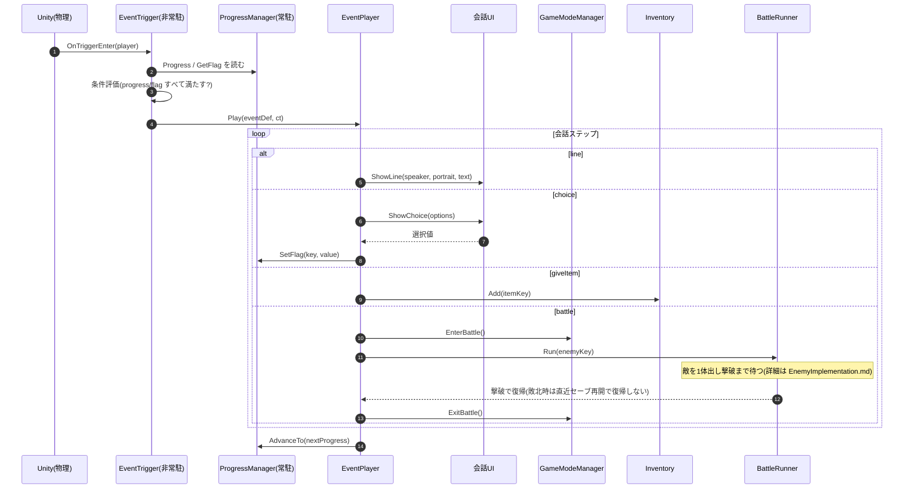

# イベント発火の実装(手順とフロー)

`events.json` の取り込み〜トリガー設置〜再生の **手順**。進行管理の **仕様**(進行度・フラグ・`EventDefinition` の中身)は [Specification.md](./Specification.md)「進行管理」、`events.json` の書式は [CharactersAndEvents.md](./CharactersAndEvents.md)。

---

## 1. イベントを取り込んで設置する(Unity Editor でやること)

物語班が書くのは **`events.json` のテキストだけ**。それを取り込み、シーンに置くのがこの節。

**① `events.json` を取り込む**
- 物語班が `events.json` を書く(既定パス `_Project/Features/Scenario/events.json`。書式は [CharactersAndEvents.md](./CharactersAndEvents.md))
- **`Tools > CreativeAI > Import Events`** を実行 → `_Project/Features/Scenario/Data/Dialogues/{id}.asset` が **1イベント=1 .asset** で生成される(既存は GUID 保持で上書き=トリガーの参照が壊れない)。バッチは `-executeMethod CreativeAI.Scenario.Editor.EventImporterMenu.Run`
- **Importer が弾くもの**(打ち間違い対策):必須フィールド欠落・id 重複・未知の `type`/`kind`・`battle` 位置制約(先頭/末尾は line)・portrait キー照合。`enemyKey`/`itemKey` は **カタログがあれば弾く**(`EnemyDB` の enemyKey / `ItemData` の key。未作成カテゴリは警告どまり)。エラーが1件でもあれば **1件も書き出さず**全診断を Console に出す

**② 発火位置ごとに `EventTrigger` を置く**
座標は JSON に書かない。**イベントが起こる場所はシーン上に手で置く**。

| 手順 | やること |
|---|---|
| 1 | フィールドシーンの発火させたい位置に **空の GameObject** を作る |
| 2 | **Collider を付け `Is Trigger = ON`**(プレイヤー侵入を検知する範囲。大きさ・位置でエリアを決める) |
| 3 | **`EventTrigger` をアタッチ** |
| 4 | `EventTrigger` の `EventDefinition` スロットに、**①で生成した `.asset`** をアサイン |
| 5 | プレイヤー(`PlayerRig`)側に **Tag `Player` + Rigidbody + Collider** があるか確認(`OnTriggerEnter` の前提 → [PlayerImplementation.md](./PlayerImplementation.md)) |

> `EventPlayer` スロットへのアサインは不要(常駐 EventPlayer に seam でフォールバックする)。差し替えたいときだけ明示アサインする。

- 発火するか(進行度・フラグ条件)は `.asset`(ScriptableObject)側が持つ。トリガーは **場所と範囲だけ**を担当する。
- 1つのイベントを複数箇所で発火させたいなら、同じ `.asset` を複数のトリガーにアサインしてよい。

### 確認(Play)
- `events.json` を Import → `.asset` が生成され、Console にエラーが出ない
- トリガー範囲に入る → 条件を満たせば会話が **出る**
- 条件未達 / 未配線なら **発火しない**(クラッシュしない)

---

## 2. 関数レベルのフロー(EventPlayer)

- `EventTrigger` は Unity がコライダ侵入で叩く。条件を満たせば `EventPlayer.Play()` を呼ぶだけ。
- `EventPlayer` が会話ステップを順に実行し、各ステップで他システム(会話UI・`GameModeManager`・`Inventory`・`ProgressManager`)を叩く。ここが他システムを **指揮する層**(会話→戦闘→会話…)。
- `ProgressManager` は **状態を持つだけ**。進行度・フラグを読ませ／書かせ、変わったら通知する。

