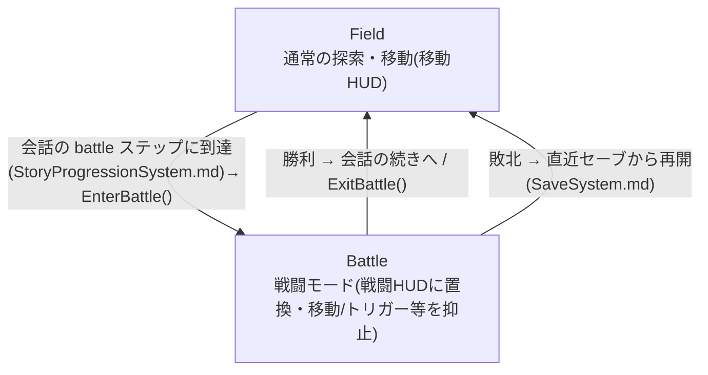
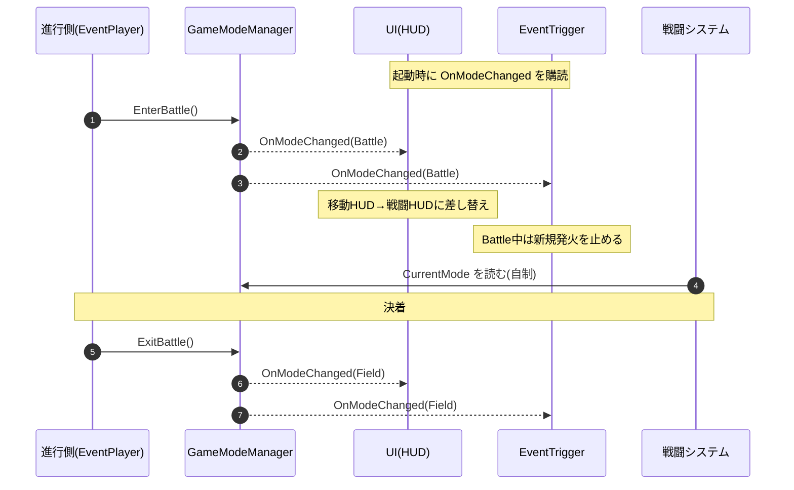

# ゲームモード(Field / Battle)

移動シーン上で **戦闘を別シーンに分けず「モード」で切り替える**ための仕組み。現在のモードを表す状態を1つだけ持ち(Single Source of Truth)、各システムはそれを見て自分の挙動を変える・自制する。

---

## 1. モードと遷移

`GameMode { Field, Battle }` は移動シーンの中で切り替わる(**シーン遷移しない**)。

- 戦闘は **会話(イベント)の途中**でのみ発生する(`StoryProgressionSystem.md`:戦闘は単独・末尾にならない)
- 戦闘は **勝敗を記録しない**。状態は進行度で判定する(`StoryProgressionSystem.md`)
- HUDの置き換え(移動HUD ⇔ 戦闘HUD)はモード変化に同期する([UISystem.md](./UISystem.md) §1)

---

## 2. モード別にできること / できないこと

各システムは「自分は今のモードで動いてよいか」を `GameMode` に問い合わせて **自制する**。中央が全部を止めるのではなく、各システムが状態を見て自分を止める。

| システム | Field(移動中) | Battle(戦闘中) | 根拠 / 補足 |
| -------- | -------------- | ---------------- | ----------- |
| セーブ(セーブUI) | ○ | **×** | `SaveSystem.md` 3章:セーブは移動中のみ。戦闘途中のスナップショットは作らない |
| 自由移動 | ○ | ○ | 戦闘中も移動できる(位置取り含む)。挙動の実体はシステム班の領分 |
| **エリアトリガーのイベント発火** | ○ | **×** | ★ 戦闘中に別トリガーへ侵入して別イベントが多重発火するのを防ぐ。`EventTrigger`(システム班)が抑止する |
| 食材使用(移動中・インベントリ食材タブ) | ○ | **×** | 戦闘中はインベントリを開けない |
| 食材使用(戦闘食材UI・最大3枠) | ―(セットはFieldで行う) | ○ | 戦闘中はセット済みの3つのみ使用 |
| 戦闘食材のセット(キャラクターUIの戦闘食材タブ) | ○ | × | 戦闘食材(最大3つ)を事前にセット |
| 調合UI | ○(調合場所でのみ) | ×(戦闘中は調合場所で発生しない想定) | [UISystem.md](./UISystem.md) §1 |
| インベントリUI / キャラクターUI | ○ | **×** | 戦闘中は装備変更・ステータス確認・戦闘食材セットを開かせない |

---

## 3. 実装(GameModeManager)

最小構成。重いステートマシン基盤は作らない。

- `GameModeManager`(常駐): 現在の `GameMode` を1つ保持し、`EnterBattle()` / `ExitBattle()` で遷移する。**モード変化を通知**(イベント or 監視可能なプロパティ)
- 各システムは `GameModeManager` を参照 or 購読し、**自分で自分をゲートする**
  - `EventTrigger`: `Battle` 中は新規イベントを発火しない
  - セーブUI: `Battle` 中はセーブ操作を無効化
  - インベントリUI(食材タブ含む): `Battle` 中は開かせない。代わりに戦闘食材UI(セット済み最大3つ)を表示する

> 中央は「状態を持つだけ」。各システムが状態を見て自制することで、戦闘・移動の実装と疎結合のまま境界を切れる。

---

## 4. 関数レベルのフロー

「モードを持つだけ」を呼び出し関係に落としたもの。**状態を変える人（進行側）と、変化に追従する人（UI・EventTrigger 等）を分ける**のが要点。中央 `GameModeManager` は前者の書き込みを受け、後者へ通知するだけ。

- `EnterBattle()` / `ExitBattle()` … **叩くのは進行側だけ**（会話の `battle` ステップ到達で Enter、決着で Exit → [StoryProgressionSystem.md](./StoryProgressionSystem.md)）。戦闘・UI・調合は呼ばない。
- `CurrentMode` / `OnModeChanged` … 各システムが**読む/購読する**側。自分が今動いてよいかを自制する（§2）。

