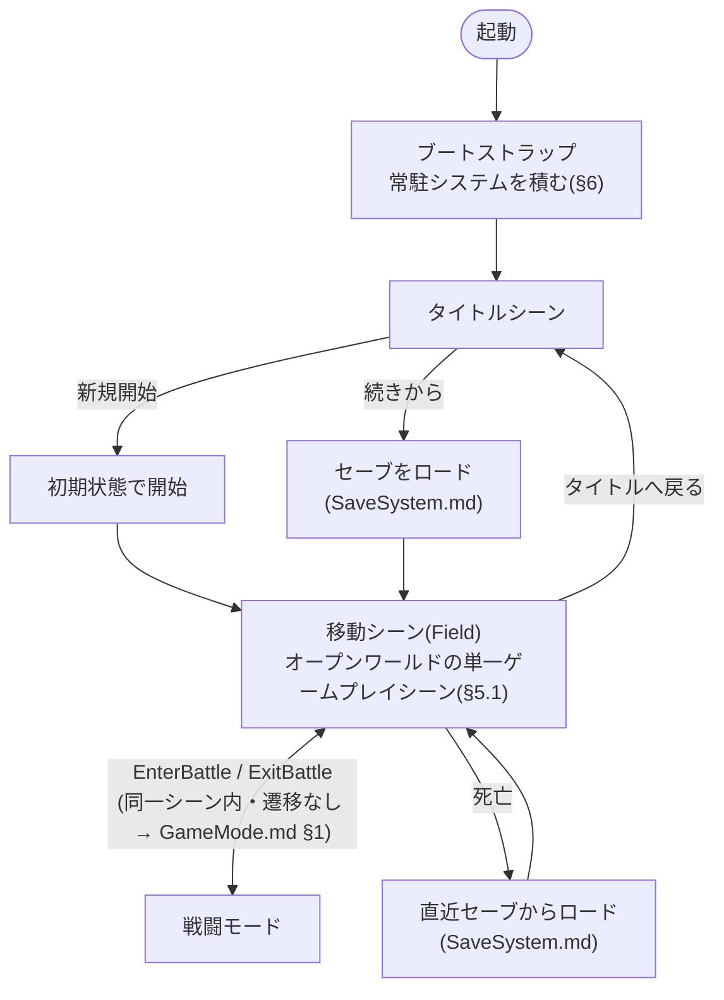
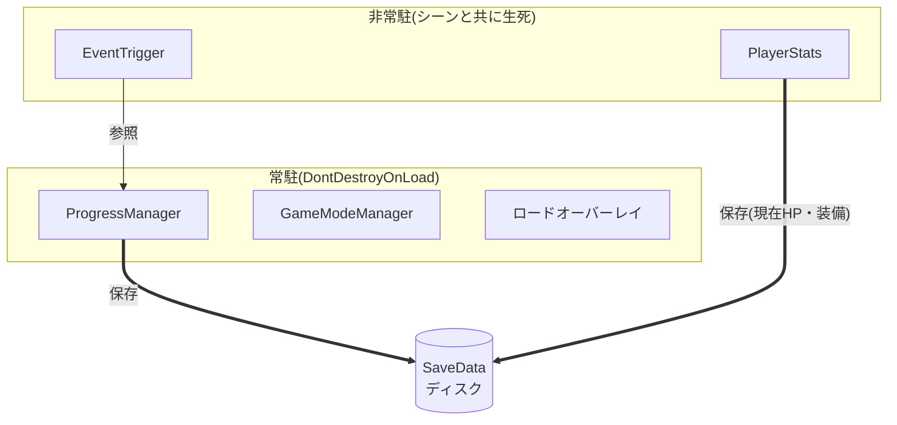

# ゲームシステム一覧

ゲームに実装する機能を **システム的な観点** でまとめたもの。
ジャンルは **3Dアクションアドベンチャー** を想定している。

---

## 0. プロジェクト前提(確定事項)

各機能のスコープ・規模を判断する際の共通の基準。

| 項目                    | 内容                                                                 |
| ----------------------- | -------------------------------------------------------------------- |
| 想定ストーリークリア時間 | **メインストーリーを0.5～1時間でクリアできるボリューム** |
| 戦闘システム            | **戦闘専用シーンは設けず、フィールド(移動)シーン上で「戦闘モード」の on/off により管理する**(戦闘で別シーンへ切り替えはしない)                  |
| 戦闘方式                | **リアルタイムアクション** |
| 戦闘形式                | **1戦闘につき敵は1体のみ**                                                       |
| 会話演出                | **2Dの会話UIをオーバーレイ表示**。**戦闘前後やイベント時に移動シーン上で表示** し、**専用シーンへの遷移はしない**(UI詳細は [UISystem.md](./UISystem.md)) |
| ストーリー進行          | **シナリオ分岐あり**。**進行度(整数1つ) + フラグ + 場所到達トリガー方式** でイベントを駆動(特定エリア侵入時、進行度・フラグに応じてイベントを発火。フラグは2択以上の分岐の保持用。詳細は  `StoryProgressionSystem.md`) |
| 成長システム            | **レベル制は無し**(経験値・レベルアップによるステータス上昇は扱わない)             |
| マップ構造              | **オープンワールド形式**(マップ全体を **1つのゲームプレイシーン** に作成。エリア間のシーン遷移はせず、シームレスに移動する)。ただし **ミニマップ・全体マップUIは実装しない**(画面上に常時マップを表示する仕様は持たない) |
| 敵構成                  | 雑魚敵なし、**中ボス以上のみで構成**。**最低でも3体以上配置**(上限は未決) |
| HP回復方式              | **食材使用のみ**(HP即時回復効果を持つ食材を使う)。**回復場所での回復は無し**・フィールド上での **時間経過による自動回復も無し** |
| 調合実行可能場所        | **調合場所でのみ可能**(フィールド上のどこでも調合できるわけではない)              |
| 食材の使用可能タイミング | **戦闘中・移動中いずれでも使用可能**(会話UI表示中など、操作不能なイベント中は不可) |
| フィールド上のアイテム  | 取得可能なアイテムは **キラキラとしたエフェクト** を伴って地面に配置される           |
| セーブ / 死亡時挙動     | **マニュアルセーブのみ**(自動セーブなし)・**単一スロット**上書き・**フィールドでの移動中のみ**(戦闘モード中・会話UI表示中は不可)発動。死亡時は直近セーブから再開。発動条件・保存内容の正本は `SaveSystem.md` |
| ネット接続              | **完全オフラインで動作**(ネット接続不要)。調合の結果(名前・説明・画像)も**事前生成して同梱**するため、調合を含め全機能がオフラインで完結する(CDN・サーバーは持たない)。詳細は `CraftingArchitecture.md` |

---

## 1. プレイヤー

| 機能           | 内容                                                       |
| -------------- | ---------------------------------------------------------- |
| ステータス保持 | HP・攻撃力・防御力などの実行時データを保持(**装備・食材の集約と戦闘/UIへの最終値公開の正本は [PlayerStatsSystem.md](./PlayerStatsSystem.md)**) |
| 入力           | コントローラ / キーボード入力の受付と行動への変換          |
| 移動           | 歩行・走行                                                 |
| 攻撃           | 通常攻撃のみ(**最低1パターン以上**)             |
| 防御           | 防御アクションでダメージを軽減(具体仕様は別途定義)  |
| 被ダメ         | ヒット判定・ダメージ受け取り・**被ダメリアクション**(怯み状態は持たない)             |
| 死亡           | HP0時に **直近のマニュアルセーブから再開**(状態はその時点まで巻き戻し。セーブの正本は `SaveSystem.md`)                 |

---

## 2. 敵

> 戦闘終了時の演出(死亡・消滅)は **戦闘モード終了後、同じフィールドシーン上に会話UIをオーバーレイ表示** して処理するため、ここでは扱わない。

| 機能           | 内容                                                       |
| -------------- | ---------------------------------------------------------- |
| ステータス保持 | HP・攻撃力・防御力などの実行時データを保持                 |
| 攻撃           | プレイヤーへの攻撃(**最低1パターン以上**)       |

---

## 3. インベントリ / アイテム / 装備

> 食材・装備品・武器・大事なもの を **共通のインベントリ** で管理する。容量は事実上無制限。
> インベントリUIは **所持品の閲覧**(タブ: 武器 / 装備品 / 食材 / 大事なもの)に加え、**食材タブで移動中の食材使用** を行う。**装備品・武器の装備変更と、戦闘で使う食材(最大3つ)のセットはキャラクター画面(主人公のみ)** で行う。

| 機能         | 内容                                                       |
| ------------ | ---------------------------------------------------------- |
| アイテム定義 | 種別・効果・アイコンなどのマスタデータ(食材 / 装備品 / 武器共通) |
| 保持・追加・削除 | 取得・装備解除・調合などによる出し入れ                 |
| 装備         | 装備品・武器によるステータス補正をプレイヤーに反映         |
| 拾得         | フィールド上のアイテムを取得しインベントリへ追加(キラキラ演出を伴って地面に配置) |

### 3.1 アイテムカテゴリと付与ステータス

アイテムは以下の **3カテゴリ** に分類される。

| カテゴリ | 装備数上限 | 付与ステータス候補                                                                                            | 付与数 | 備考                                                       |
| -------- | ---------- | ------------------------------------------------------------------------------------------------------------- | ------ | ---------------------------------------------------------- |
| 装備品   | 最大3つ    | 攻撃% / 防御% / 移動速度% / 攻撃速度% / 会心ダメージ / 会心率 / **最大HP%**     | 最大2つ | プレイヤーは装備品を同時に3つまで装着できる                |
| 食材     | -          | **HP即時回復** のみ  | 1つ | **時間制限バフは持たない**(攻撃%等の効果は無し)。回復量は固定で合成前後により異なる(値の正本は [CraftingStatAlgorithm.md](./CraftingStatAlgorithm.md)、使用ルールは 3.2) |
| 武器     | 最大1つ    | 攻撃% / 防御% / 移動速度% / 攻撃速度% / 会心ダメージ / 会心率 / **最大HP%**     | 最大2つ | 同時に装備できる武器は1本まで(装備品3つ枠とは別)。**装備時にプレイヤーが手に持って表示されるため、武器ごとに専用の3Dモデルが必要**(視覚班担当) |

> **HP関連の補足**: 装備品・武器の「最大HP%」は **最大HP値を増加** させる継続バフ。食材の「HP即時回復」は **使用時に現在HPを回復** する即時効果。装備品・武器に即時回復効果は無く、食材に最大HP増加効果は無い。
> **食材のHP即時回復量は固定値**（全食材共通・素材の組み合わせに依らず一定、合成前後で異なる）。**具体値はここで持たず、正本は [CraftingStatAlgorithm.md](./CraftingStatAlgorithm.md)**（装備品との扱いの違いは 3.3）。

> **集約の補足**: ここで定義した付与ステータスを **base に集約してプレイヤーの最終ステータスを出す仕組み(戦闘・UIはその最終値を読むだけ)の正本は [PlayerStatsSystem.md](./PlayerStatsSystem.md)**。値の合成ルール等はそちらで扱う。

> **大事なもの(キーアイテム)の補足**: ストーリー進行用のアイテム。ステータス付与・装備・調合・使用の対象外で、上記3カテゴリには含まれない。インベントリUIで **閲覧のみ** できる。

### 3.2 食材の使用ルール

食材を使う **導線は移動中(Field)と戦闘中(Battle)で異なる**(モードの正本は [GameMode.md](./GameMode.md))。会話UI表示中など操作不能なイベント中はどちらも使用不可。

| 項目             | 内容                                                                                       |
| ---------------- | ------------------------------------------------------------------------------------------ |
| 移動中(Field)  | **インベントリUIの食材タブ** から所持食材を選んで使用(インベントリを開く → 食材タブ → 所持食材から選択 → 効果適用)。戦闘が無いため専用のクイックUIは持たない |
| 戦闘中(Battle) | 通常のインベントリは開けない。**戦闘前にキャラクターUIの戦闘食材タブで最大3つセット**した食材だけを、**戦闘食材UI** から使用する |
| 効果適用         | **HP即時回復をその場で適用**(食材の効果はHP回復のみ。時間制限バフは持たない)                |
| 一時停止         | **戦闘中**は食材使用でも一時停止しない(即時回復のみ・時間は止まらない)。移動中はインベントリの食材タブから使うため即時性は問わない |

### 3.3 調合システム

> 既存のアイテムを掛け合わせて新たなアイテムを生成する仕組み。
> ステータスはカテゴリで扱いが分かれる: **装備品は端末で確率的にロール**(同じ素材ペアでも個体差が出る)、**食材は固定値**(ロールなし)。アーキテクチャは [CraftingArchitecture.md](./CraftingArchitecture.md)、ステータス算出は [CraftingStatAlgorithm.md](./CraftingStatAlgorithm.md) を参照。

| 機能             | 内容                                                                       |
| ---------------- | -------------------------------------------------------------------------- |
| 実行可能場所     | **調合場所(フィールド上の固定地点)でのみ実行可能**。それ以外の場所では調合UIを開けない   |
| 対応カテゴリ     | **装備品同士** / **食材同士** の調合が可能(カテゴリを跨いだ調合は不可)。**武器は調合不可** |
| 基本アイテム数   | **合成前の素材(ベース)は決め打ちで固定: 食材10種 + 装備品15種 = 計25種**(手書き・同梱)。合成後の結果はこのベースから事前生成して同梱(ベース同士の全ペア = C(10,2)+C(15,2) = 150件が**起点**。連鎖で結果を素材に使う分は別途 → [CraftingArchitecture.md](./CraftingArchitecture.md)) |
| 組み合わせ       | 組み合わせ制限は無し(**任意の2点を組み合わせ可能**)。**全ペアを事前生成**して持つため有限・閉じている(結果も既存アイテムを指す) |
| 結果生成         | 結果アイテムの名前・説明・画像は**事前生成してゲームに同梱**(CDN・サーバー無し)。ステータスは**カテゴリで扱いが分かれる**(下記) |
| ステータス決定   | **装備品**は入力素材から**端末で確率的にロール**(合成前も合成後も1つ1つ個体差あり＝原神的)。**食材**は**固定値**(ロールしない・全食材共通)。**具体値の正本は [CraftingStatAlgorithm.md](./CraftingStatAlgorithm.md)**、アーキテクチャは [CraftingArchitecture.md](./CraftingArchitecture.md) |
| ネット接続       | **不要**。結果も同梱するため調合は**完全オフライン**で完結する(→ [CraftingArchitecture.md](./CraftingArchitecture.md)) |
| 素材消費         | 調合に使用した素材はインベントリから消費される                              |
| UI               | 調合場所で調合UIを開き素材を選択 → 結果プレビュー → 確定                     |
| 失敗・例外       | 失敗状態は持たず、許可された組み合わせは必ず結果アイテムが生成される         |

---

## 4. 進行管理

> **セーブ(発動条件・保存内容・スロット運用・ロード)の正本は [SaveSystem.md](./SaveSystem.md)**。ここでは扱わない。

進行管理は進行度(整数)とフラグ(分岐の保持)で行う(→ / `StoryProgressionSystem.md`)。

| 機能               | 内容                                                       |
| ------------------ | ---------------------------------------------------------- |
| 進行度・フラグ管理 | メイン進行度とフラグの保持・更新(`ProgressManager`)        |
| イベントトリガー   | 位置・進行度・フラグなどの条件によるイベント発火 |

### 4.1 進行制御方式: 進行度 + フラグ + 場所到達トリガー

正本は [StoryProgressionSystem.md](./StoryProgressionSystem.md)。要点のみ:

- ストーリーは **メイン進行度(整数)** で管理し、進行度に畳めない分岐(2択以上)は **フラグ** で併用する。特定エリア侵入時、進行度・フラグを条件にイベントを発火する
- 「進行度5でエリアXに入ったらこの会話を再生」と定義するだけで脚本を組める。進行度さえ保存すればどこから再開しても整合し、デバッグも進行度を書き換えるだけでよい
- 実装担当: `ProgressManager`(状態保持)・`EventTrigger`(発火判定)・`EventPlayer`(会話再生の指揮役=「進行側」)の3つ(`Features/Core/Scripts/EventSystem/`)。役割と呼び出し関係の正本は [StoryProgressionSystem.md](./StoryProgressionSystem.md)

---

## 5. シーン

ゲーム画面は次の2層に分けて扱う:

- **シーン**: フルスクリーン状態。互いに **相互排他** で、シーン間は遷移(必要に応じてロードシーンを挟む)
- **UI / オーバーレイ**: シーン上に重ねて表示。開閉可能で、複数同時に出すこともある

このうち **UI / オーバーレイ一覧(各UIの中身・レイアウト・表示元)の正本は [UISystem.md](./UISystem.md)**。モード(Field / Battle)別の表示可否は [GameMode.md](./GameMode.md)。ここでは **シーン** を扱う。

### 5.0 起動〜プレイの全体フロー

起動からプレイまでの **画面/シーンレベルの俯瞰**。各ノードのルール(モード別可否・セーブ発火条件など)は正本へ:Field ⇄ Battle の詳細は [GameMode.md](./GameMode.md) §1、UIの開閉は [UISystem.md](./UISystem.md)、セーブ/死亡は [SaveSystem.md](./SaveSystem.md)。ここは**遷移の形**のみ示す。

> シーンのロード(タイトル ⇔ 移動シーン、続きから)は **ロードオーバーレイ**(常駐 Canvas)を挟む(§5.1 / [UISystem.md](./UISystem.md))。

### 5.1 シーン一覧

| シーン           | 内容                                                                  |
| ---------------- | --------------------------------------------------------------------- |
| タイトルシーン   | ゲーム起動直後の画面。新規開始 / 続きから への入口              |
| 移動シーン       | 3Dフィールドでの探索・移動・戦闘を行う **オープンワールドの単一ゲームプレイシーン**(マップ全体を含み、エリア間もシーン遷移しない)。通常は移動HUD、**戦闘モード中は戦闘HUDに置き換わる**(戦闘で別シーンへは遷移しない) |

> **モード(Field/Battle)の定義・モード別にできること/できないこと・on/off機構の正本は [GameMode.md](./GameMode.md)**。ここではシーン視点の概要のみ。

> **ロード画面はシーンではなく UI オーバーレイで実装する**(ロードオーバーレイ → [UISystem.md](./UISystem.md))。`SceneManager.LoadSceneAsync` の進捗を、`DontDestroyOnLoad` で常駐させた Canvas 上のオーバーレイに反映する方式。シーン化すると「ロード画面を出すためにロード画面をロードする」入れ子になり、現在の Unity では利点がない。

### 5.2 移動シーンの描画・ロード最適化方針

移動シーンは **単一シーンにマップ・オブジェクトを全読み込み** する(§0 のオープンワールド構成)。想定は **PC**・マップは広大ではないが **3Dモデル数は多め**(屋内含む)という規模。

- **距離ストリーミングは持たない**(Addressables 等での距離ロード/アンロードはしない)。マップが広大でなく、PC のメモリ(RAM/VRAM)には全モデルが載る想定のため。先回りで作らず、複雑さを避ける
- 描画負荷は次の3つで対応する(「メモリに載せない」ではなく「載っている物を描かない/軽く描く」):

| 手法 | 役割 | 備考 |
| ---- | ---- | ---- |
| オクルージョンカリング | 壁の裏など隠れた物を描画しない | **屋内・多モデルで最も効く**。ベイクが必要 |
| バッチング(Static Batching / GPU Instancing / SRP Batcher) | 同一モデル・マテリアルをまとめて描きドローコールを削減 | モデル**数**が多いほど効く |
| LOD | 距離に応じて低ポリモデルへ差し替え | 大きい/遠い物向け。マップが広くないため効果は中程度 |

- **メモリが予算を超えた場合**は、ストリーミング導入より先に **テクスチャ圧縮・アトラス化・ポリ削減** で対処する。それでも収まらなければ、その時点で初めてストリーミング(Addressables / Additive Scene 分割)を再検討する

---

## 6. 常駐システム(ゲーム起動中ずっと常駐)

**ゲーム起動中ずっと常駐し、シーンのロード(タイトル ⇔ ゲームシーン、セーブのロード)をまたいで生き続ける** システムの索引。`DontDestroyOnLoad` で常駐させ、起動時のブートストラップに積む。詳細(API・思想)は各正本を参照し、ここでは一覧のみ。

| 常駐システム | 役割 |
| ---------------- | ---------------------------------------- |
| `GameModeManager` | Field / Battle 状態の保持・変化通知 |
| `ProgressManager` | メイン進行度・フラグの保持(セッションを通じて保持) |
| ロードオーバーレイ(常駐 Canvas) | シーン遷移中のロード表示 |

> `PlayerStats` は**この表(常駐)には載せない**。プレイヤー実体と一緒に移動シーン上に生きる**非常駐**コンポーネント(理由 → [PlayerStatsSystem.md](./PlayerStatsSystem.md) §4)。下の2軸表では「非常駐 × 保存される」に位置する。

> **2つの軸(常駐か / 保存されるか)は別物**。まず下の表で整理する。

| | **ファイルに保存される** | **保存されない** |
| --- | --- | --- |
| **常駐する** | `ProgressManager`(進行度・フラグ) | `GameModeManager` / ロードオーバーレイ |
| **常駐しない**(シーンと共に生死) | `PlayerStats`(現在HP・装備セット → [SaveSystem.md](./SaveSystem.md)) | `EventTrigger` |

> 上の表に加え、**非常駐が誰を参照するか**まで見たい場合の図:

> **常駐しないもの**: `EventTrigger` は **ワールドシーン上の各トリガー(位置)に配置するコンポーネント**で常駐しない。単一のゲームプレイシーンがプレイ中ずっとロードされたままなので、シーンと一緒に生き、タイトルに戻れば一緒に消えてよい。判定に必要な状態(進行度・フラグ)は常駐の `ProgressManager` が持つため、`EventTrigger` 自体を常駐させる必要はない(混同を避けるため明記)。