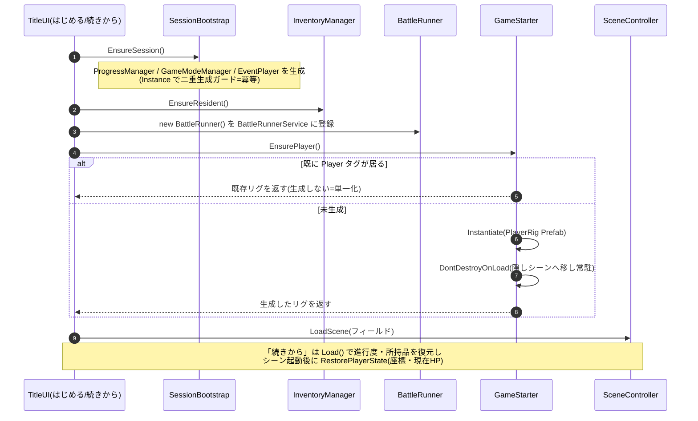
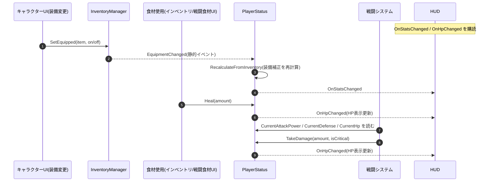

# プレイヤーの実装(手順とフロー)

プレイヤーを Unity 上でどう実装するか。ステータスの **仕様**(素の値 + 装備の補正の合算)は [Specification.md](./Specification.md)「プレイヤーステータス」。

---

## 1. プレイヤーリグの配線(Unity Editor でやること)

**① `PlayerRig` Prefab を作る**
- **モデル + コントローラ + `PlayerStatus` + メインカメラ** を1つの Prefab にまとめ、Project に置く(**どのフィールドシーンにも置かない**)
- ルートの **Tag を `Player`** にする(`EventTrigger` が侵入判定にこのタグを使う → [EventImplementation.md](./EventImplementation.md))
- **Collider + Rigidbody** を付ける(`OnTriggerEnter` が飛ぶ前提)

**② Prefab をスロットにドラッグ**
- `01_Title` を開く → `GameStarter` を選択 → Inspector の **Player Rig Prefab** スロットへ、①の `PlayerRig` Prefab をドラッグ
- ドラッグ参照は GUID 保持でリネーム・移動に強い。**未割当なら `None` 表示**で、Play 時に「playerRigPrefab 未割当」警告が出る(フィールドは読み込めるがプレイヤーは出ない)

### 確認(Play)
- Title →「はじめる」→ フィールドにプレイヤーが **1体**出る
- エリアを移動しても **増えない/消えない**(同じ1体が持ち越される)
- 「タイトルに戻る → 再開」でも二重化しない

---

## 2. 関数レベルのフロー(Title からのリグ生成・常駐・単一化)

「はじめる/続きから」でプレイヤーリグを **1体だけ**生成して常駐させる流れ。生成順は **マネージャ → Inventory → プレイヤー**(プレイヤーが `Start` で `GameModeManager`/`Inventory` を読むため。spec §6.1)。既に `Player` タグが居れば作らない(連打・タイトル復帰での二重化防止=単一化)。

- 生成はすべて Title シーンが担う。フィールドシーンにはリグを置かない(→ [Specification.md](./Specification.md)「常駐アーキテクチャ」)。
- 「タイトルに戻る」でセッション常駐だけ破棄し、次の開始で作り直す。

---

## 3. 関数レベルのフロー(PlayerStatus)

**`PlayerStatus` が最終値を持つ唯一の場所**(素の値 + 装備の補正の合算 → [Specification.md](./Specification.md)「プレイヤーステータス」)。

