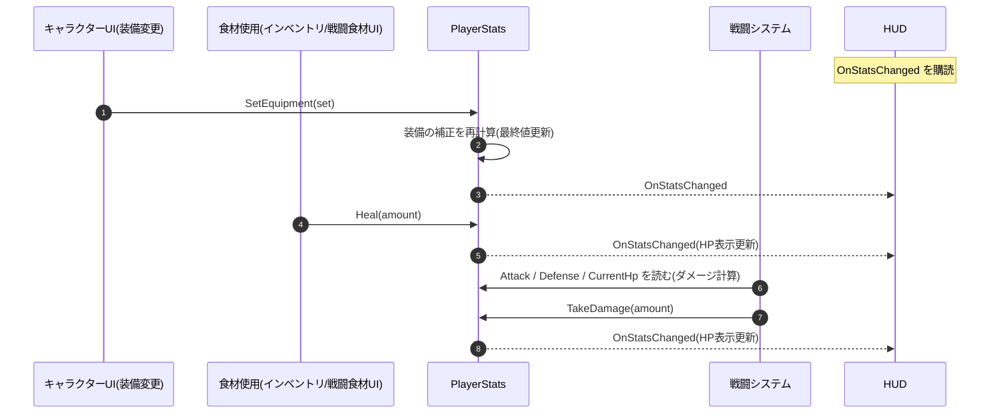

# プレイヤーの実装(手順とフロー)

プレイヤーを Unity 上でどう実装するか。ステータスの **仕様**(素の値 + 装備の補正の合算)は [Specification.md](./Specification.md)「プレイヤーステータス」。

---

## 1. プレイヤーは常に1体(モデル残留・二重化を防ぐ)

プレイヤーは **タイトルの「はじめる／続きから」で1体だけ生成し、`DontDestroyOnLoad` でシーンを跨いでも消さない**。**各フィールドシーンには置かず(埋め込むと再入場で二重化する)、スポーン地点のマーカーだけ**を置き、遷移時は生成し直さず常駐プレイヤーを入口スポーンへ移す。

**リグ生成のセットアップ手順**(シーンに置かず Prefab から生成する配線):

1. プレイヤーを **モデル＋コントローラ＋`PlayerStats`＋メインカメラ** 込みの **`PlayerRig` Prefab** にまとめる(Project に置く。**どのフィールドシーンにも置かない**)
2. タイトルシーンに開始処理スクリプト(例 `GameStarter`)を持つ空オブジェクトを置き、参照用スロットを用意する:
   ```csharp
   [SerializeField] private GameObject playerRigPrefab;   // Inspector に差し込み口が出る
   ```
3. **タイトルシーンで手順2の `GameStarter` を選択し**、Inspector に出た空スロット(`playerRigPrefab`)へ Project の `PlayerRig` Prefab を **ドラッグして紐づける**(この配線はタイトルシーンの `GameStarter` 上だけ。フィールドシーンには何も置かない)。ドラッグ参照は `Resources.Load` の文字列指定より安全 ― Unity が GUID で保持するので**リネーム・移動しても切れず**、**未割当なら Inspector に `None` と出て目視できる**(文字列指定は実行するまで失敗に気づけない)
4. 「はじめる／続きから」処理で生成する:
   ```csharp
   if (playerRigPrefab == null) { /* 未割当ガード */ return; }
   var player = Instantiate(playerRigPrefab);   // モデル込みで丸ごと生成(シーンに置かなくても出る)
   DontDestroyOnLoad(player);                    // 隠しシーンへ移り常駐
   // → フィールドシーンをロード → player を入口スポーンへ移動
   ```
5. 二重生成ガードを入れる(既にプレイヤーが居たら作らない)。連打・「タイトルに戻る→再開」での増殖を防ぐ

> `Instantiate` は **Prefab(モデル入りの設計図)から実行時に実体を作る** ので、フィールドシーンに事前配置しなくてもモデルは描画される。常駐させた実体は Unity の隠しシーン「DontDestroyOnLoad」に住み、カメラが現在のフィールドシーンに重ねて描く。

> **他シーンでも使える理由**: 共有されるのは Prefab 参照ではなく、生成された**実体**のほう。手順3の Prefab スロットは**タイトルシーンで1回、実体を作る時にしか使わない**。`DontDestroyOnLoad` した実体はシーンのロード/アンロードで破棄されないので、フィールドを移動しても**同じ1体が生き続ける**。各フィールドシーンは作り直さず、この実体を入口スポーンへ移すだけ。常駐区分は [Specification.md](./Specification.md)「常駐アーキテクチャ」(セッション常駐・保存あり)。

---

## 2. 関数レベルのフロー

**`PlayerStats` が最終値を持つ唯一の場所**。


