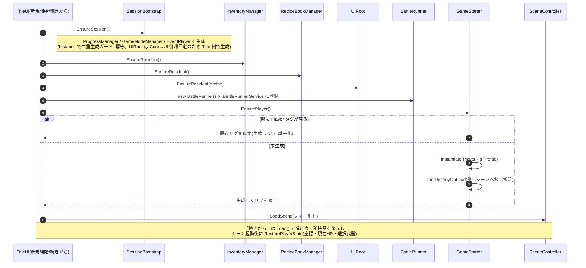

# プレイヤーの実装(手順とフロー)

プレイヤーを Unity 上でどう実装するか。ステータスの **仕様**(素の値 + 装備の補正 + 武器の補正の合算)は [Specification.md](./Specification.md)「プレイヤーステータス」。

---

## 1. プレイヤーリグの配線(Unity Editor でやること)

**① `PlayerRig` Prefab を作る**
- **モデル + コントローラ + アニメーション + `PlayerStatus` + メインカメラ** を1つの Prefab にまとめ、Project に置く(**どのフィールドシーンにも置かない**)
- ルートの **Tag を `Player`** にする(`EventTrigger` が侵入判定にこのタグを使う → [EventImplementation.md](./EventImplementation.md))
- **Collider + Rigidbody** を付ける(`OnTriggerEnter` が飛ぶ前提)
- **武器3本のモデルと `WeaponManager` も同じ Prefab に含める**(手ボーン下に3体を子として置き、`WeaponManager._weapons[]` に登録。選択中1本だけ `SetActive` で表示・切替の詳細は `Features/Player/Scripts/WeaponManager.cs`)。リグの子なのでリグと一緒に常駐・持ち越される

**② Prefab をスロットにドラッグ**
- `01_Title` を開く → `GameStarter` を選択 → Inspector の **Player Rig Prefab** スロットへ、①の `PlayerRig` Prefab をドラッグ

### 確認(Play)
- Title →「新規開始」→ フィールドにプレイヤーが **1体**出る
- エリアを移動しても **増えない/消えない**(同じ1体が持ち越される)
- 「タイトルに戻る → 再開」でも二重化しない

---

## 2. 関数レベルのフロー(Title からのリグ生成・常駐・単一化)

「新規開始/続きから」でプレイヤーリグを **1体だけ**生成して常駐させる流れ。生成順は **マネージャ → InventoryManager → プレイヤー**(プレイヤーが `Start` で `GameModeManager`/`InventoryManager` を読むため)。既に `Player` タグが居れば作らない(連打・タイトル復帰での二重化防止=単一化)。

---