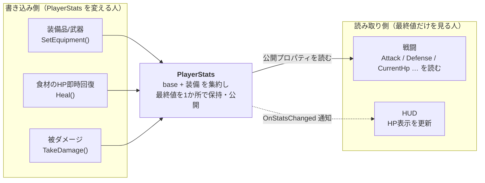
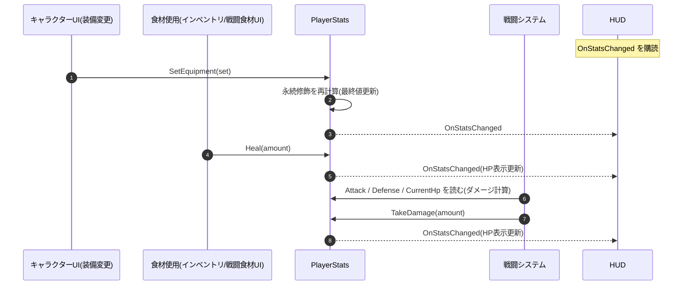

# プレイヤーステータス集約

このドキュメントが **実行時のプレイヤーステータスの集約(base + 装備修飾)と、戦闘・UI への公開の正本**。

---

## 1. 何を集約するか(base + 装備修飾)

| 層 | 元 | いつ再計算 | 性質 |
| -- | -- | ---------- | ---- |
| **base** | プレイヤーの素の値 | 固定(**レベル制なし**なので経験値で上がらない → [GameSystems.md](./GameSystems.md) §0) | 攻撃力・防御力・最大HP など |
| **永続修飾** | 装備品(最大3)+ 武器(1)の `攻撃%`/`防御%`/`最大HP%`/`会心` 等 | **装備変更時のみ** | 付け外しで変わる継続バフ |

```
最終ステータス = base に 装備修飾 を集約したもの
                    ↑装備変更で更新
```

---

## 2. 戦闘への反映(戦闘は「読むだけ」)

**戦闘システムは装備品・食材・インベントリを一切見ない**。`PlayerStats` が公開する最終値(攻撃力・防御力・会心率・会心ダメージ・現在HP/最大HP…)だけを読む。



> 戦闘・HUD は「最終値を読む/変化を購読する」だけで、`PlayerStats` へは書き込まない。書き込むのは左側の3つ(装備変更・食材使用のHP回復・被ダメージ)に限られる。この一方向性が「最終値のSSOTは `PlayerStats` 1か所」を保つ。

- **ダメージ計算のロジックは戦闘側**に置くが、入力は `PlayerStats` の公開値。「装備で攻撃%が…」を戦闘が知る必要はない。
- 敵は別に自分のステータスを持つ([GameSystems.md](./GameSystems.md) §2)。戦闘は「`PlayerStats` の攻撃力」と「敵の防御力」を突き合わせて計算するだけ。
- 変化の伝播は `OnStatsChanged`(仮名)通知で。HUD の HP表示・最大HP変動はこれを購読([UISystem.md](./UISystem.md))。

> **公開の契約**: 各班は最終ステータスを `PlayerStats` から読む/変化を購読する。関数名は仮、シグネチャの正本はコード(具体シグネチャは §5)。

---

## 3. モード / 導線との整合

- **装備変更は Field のみ**(キャラクターUI → [GameMode.md](./GameMode.md) §2)。永続修飾の再計算は戦闘外で起き、**戦闘中に装備は変わらない**。
- **食材使用は Field / Battle 両方**([GameSystems.md](./GameSystems.md) §3.2)。食材の効果は **HP即時回復のみ**(時間制限バフは無い)なので、`Heal` で現在HPをその場で動かすだけ。戦闘は次のフレームで新しい現在HPを読む。
- **戦闘は食材使用で一時停止しない**(§3.2)が、即時回復のみなので継続効果やタイマーは無い。

---

## 4. 置き場所と保存

- `PlayerStats` は**常駐ハブではなく、プレイヤーと一緒に移動シーン上に生きるコンポーネント**(単一ゲームプレイシーンが常時ロードされているため)。`GameModeManager`/`ProgressManager` のような `DontDestroyOnLoad` 常駐にはしない(常駐の一覧は [GameSystems.md](./GameSystems.md) §6)。

---

## 5. 関数レベルのフロー

**`PlayerStats` が最終値を持つ唯一の場所**。



---

## 6. 決定事項(計算ルール)

装備の挙動は**原神準拠**でそろえる。

1. **`最大HP%` で最大HPが変わったときの現在HP** → **据え置き**。現在HPは絶対値のまま動かさず、装備を外して現在HP > 新・最大HP になった場合だけ上限にクランプする。
   - スケール(比率維持)は採らない。装備を着けただけで回復してしまい、**回復は食材のみ**([GameSystems.md](./GameSystems.md) §0)の前提を崩すため。
2. **同種 `%` の合成** → **加算**。同じ種類の%は足し合わせてから base に掛ける: `最終値 = base ×(1 + Σその種類の%)`（例: 攻+10% と 攻+20% → base×1.30）。
   - 乗算は装備3＋武器の重ね掛けで複利インフレし上限設計が難しいため、線形で予測しやすい加算にする。効くのは**装備品同士＋武器**の重ね掛けのみ(食材は%を持たない)。異なる種類の%は互いに独立。
