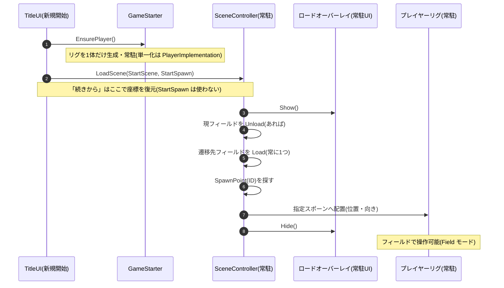
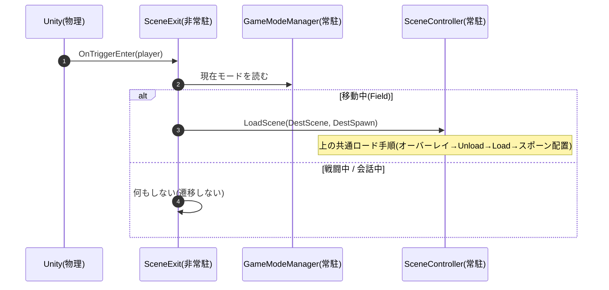

# シーン遷移の実装(手順とフロー)

`01_Title` からフィールドへ入る **遷移先の定義**〜エリア出入口の遷移〜到着時のプレイヤー配置までの **手順**。どんなシーンがあるかの仕様は [Specification.md](./Specification.md)「シーン」、Title からのリグ生成そのものは [PlayerImplementation.md](./PlayerImplementation.md)。

---

## 1. 遷移先を定義して配線する(Unity Editor でやること)

**遷移先(どのフィールドへ・どこに出るか)は JSON でもコードでもなく、シーン名スロットとシーン上の目印で決める**。新規開始の入口・エリアの出入口・到着位置の3つを配線する。

**① 遷移先シーンをビルドに登録する**
- `01_Title` と **すべてのフィールドシーン** を **Build Settings > Scenes In Build** に登録する(`SceneController` は **シーン名**でロードするため。未登録の名前を指すと遷移が失敗する)。
- **常に1つのフィールドだけがロードされる**(相互排他)。前のフィールドはアンロードしてから次を出す。

**② 新規開始の遷移先(開始フィールド)を決める**
「新規開始」で **必ず最初に入るフィールド**を1つ決める。座標は書かず、**シーン名 + 到着位置(③のスポーン)** で指す。

| 手順 | やること |
|---|---|
| 1 | `01_Title` を開く → `GameStarter` を選択 |
| 2 | Inspector の **Start Scene** に、開始フィールドの **シーン名**を入れる(②で登録済みのもの) |
| 3 | **Start Spawn** に、開始フィールドに置いた **開始スポーンの ID**(③)を入れる |

- 「新規開始」は必ず **Start Scene の Start Spawn** に出る。「続きから」はここを使わず、**セーブした座標**へ復元する(→ 2)。

**③ 各フィールドに到着位置(SpawnPoint)を置く**
プレイヤーリグはシーンに埋め込まず持ち越されるので([PlayerImplementation.md](./PlayerImplementation.md))、**到着時にどこへ置くかの目印**が要る。

| 手順 | やること |
|---|---|
| 1 | フィールドシーンの出したい位置に **空の GameObject** を作る |
| 2 | **`SpawnPoint` をアタッチ**し、**ID(文字列)** を付ける(そのシーン内で一意) |
| 3 | 向きは GameObject の回転で決める(到着時にこの向きへ揃える) |

- 開始フィールドには **開始用の SpawnPoint** を必ず1つ置き、②の Start Spawn にその ID を書く。
- 到着時に指定 ID が見つからなければ **原点へフォールバックし警告**(クラッシュしない)。ID が重複していても警告して先に見つかった方を使う。
- コンポーネントと ID 検索・配置は `Features/Core/Scripts/SceneManagement/SpawnPoint.cs`(`SpawnPoint.Place(player, id)`)。`Field_Area01` には `PlayerSpawn_start`(ID `start`)を設置済み。
- **`SceneController.LoadScene` はまだ spawn ID を受け取らない**(遷移時の自動配置は未実装 = 設計)。現時点で `SpawnPoint.Place` を呼んでいるのは開発用の直接 Play(`FieldDevBootstrap` → [PlayerImplementation.md](./PlayerImplementation.md))だけ。

**④ エリアの出入口に `SceneExit` を置く**
フィールド間の移動はここが担当する。**発火位置と遷移先の対応**をシーン上に手で置く(会話イベントの `EventTrigger` と同じ流儀 → [EventImplementation.md](./EventImplementation.md))。

| 手順 | やること |
|---|---|
| 1 | 出口の位置に **空の GameObject** を作る |
| 2 | **Collider を付け `Is Trigger = ON`**(プレイヤー侵入で遷移する範囲) |
| 3 | **`SceneExit` をアタッチ** |
| 4 | **Dest Scene** に遷移先の **シーン名**、**Dest Spawn** に遷移先の **SpawnPoint ID** を入れる |
| 5 | プレイヤー(`PlayerRig`)側に **Tag `Player` + Rigidbody + Collider** があるか確認(`OnTriggerEnter` 前提) |

- 遷移中は **ロードオーバーレイ**(シーンではなく常駐 Canvas の UI)が覆い、完了で消える。
- 遷移は **移動中(Field)のみ**。戦闘モード中・会話UI表示中は出口を踏んでも遷移しない。

### 確認(Play)
- Title →「新規開始」→ **必ず Start Scene の開始スポーン**にプレイヤーが1体出る
- Title →「続きから」→ **セーブした座標**に出る(開始スポーンは使わない → [PlayerImplementation.md](./PlayerImplementation.md))
- 出口(`SceneExit`)に入る → ロードオーバーレイが出て、**前のフィールドがアンロード**され、**遷移先の指定スポーン**に出る
- どのタイミングでも **ロードされているフィールドは常に1つ**(二重ロードしない)
- 未登録のシーン名 / 見つからないスポーン ID でも **クラッシュせず警告**(原点フォールバック)

---

## 2. 関数レベルのフロー(SceneController)

- `SceneController` は **アプリ常駐**([Specification.md](./Specification.md)「常駐アーキテクチャ」)。タイトル ⇔ フィールド遷移そのものを実行するため終了まで生き、シーンのロード/アンロードとロードオーバーレイの出し入れ、到着後のスポーン配置だけを担う(状態は持たない)。
- 新規開始は `GameStarter.EnsurePlayer()` でリグを1体作ってから `LoadScene(StartScene, StartSpawn)`。リグ生成・単一化の詳細は [PlayerImplementation.md](./PlayerImplementation.md)。
- エリア遷移は `SceneExit` が同じ `LoadScene(dest, spawn)` を呼ぶだけ。入口は違っても **ロード手順は共通**。

### SceneExit(エリア出入口の遷移)

出口コライダにプレイヤーが入ると、`SceneExit` が **移動中のみ** `SceneController.LoadScene` を呼ぶ。中身は上の共通ロード手順とまったく同じ(遷移先シーン名 + 到着スポーン ID を渡すだけ)。

