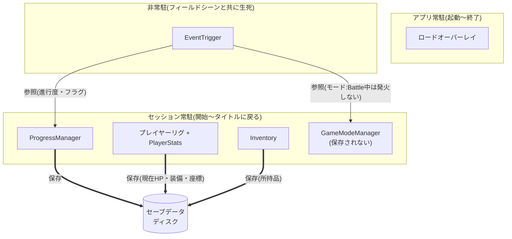

# ゲーム仕様書

ゲームに実装する機能の **仕様(要件・設計)** をまとめたもの。ジャンルは **3Dアクションアドベンチャー** を想定している。
実装手順・フロー図は各 Implementation ドキュメント([PlayerImplementation](./PlayerImplementation.md) / [EnemyImplementation](./EnemyImplementation.md) / [EventImplementation](./EventImplementation.md) / [UIImplementation](./UIImplementation.md))を参照。

---

## 0. プロジェクト前提(確定事項)

各機能のスコープ・規模を判断する際の共通の基準。

| 項目                    | 内容                                                                 |
| ----------------------- | -------------------------------------------------------------------- |
| 戦闘システム            | **戦闘専用シーンは設けず、フィールド(移動)シーン上で「戦闘モード」により管理する**                 |
| 戦闘方式                | **リアルタイムアクション** |
| 戦闘形式                | **1戦闘につき敵は1体のみ**                                                       |
| 会話演出                | **2Dの会話UIをオーバーレイ表示**。**戦闘前後やイベント時に移動シーン上で表示** |
| ストーリー進行          | **シナリオ分岐あり**。**進行度(整数1つ) + フラグ + 場所到達トリガー方式** でイベントを駆動(特定エリア侵入時、進行度・フラグに応じてイベントを発火。フラグは2択以上の分岐の保持用)。 |
| マップ構造              | **エリアごとに複数のフィールドシーンへ分割**。エリアの**出入口(境界)でシーン遷移**し、間に**ロードオーバーレイ**を挟む。 |
| 敵構成                  | 雑魚敵なし、**中ボス以上のみで構成**。 |
| HP回復方式              | **食材使用のみ**(HP即時回復効果を持つ食材を使う)。**回復場所での回復は無し**・フィールド上での **時間経過による自動回復も無し** |
| 調合実行可能場所        | **調合場所でのみ可能**(フィールド上のどこでも調合できるわけではない)              |
| 食材の使用可能タイミング | **戦闘中・移動中いずれでも使用可能**(会話UI表示中など、操作不能なイベント中は不可) |
| フィールド上のアイテム  | 取得可能なアイテムは **キラキラとしたエフェクト** を伴って地面に配置される           |
| セーブ / 死亡時挙動     | **マニュアルセーブのみ**(自動セーブなし)・**単一スロット**上書き・**フィールドでの移動中のみ**(戦闘モード中・会話UI表示中は不可)発動。死亡時は直近セーブから再開。 |

---

## 1. インベントリ / アイテム / 装備

> 食材・装備品・武器・大事なもの を **共通のインベントリ** で管理する。容量は事実上無制限。
> インベントリUIは **所持品の閲覧**(タブ: 武器 / 装備品 / 食材 / 大事なもの)に加え、**食材タブで移動中の食材使用** を行う。**装備品・武器の装備変更と、戦闘で使う食材(最大3つ)のセットはキャラクター画面(主人公のみ)** で行う。

| 機能         | 内容                                                       |
| ------------ | ---------------------------------------------------------- |
| アイテム定義 | 種別・効果・アイコンなどのマスタデータ(食材 / 装備品 / 武器共通) |
| 保持・追加・削除 | 取得・装備解除・調合などによる出し入れ                 |
| 装備         | 装備品・武器によるステータス補正をプレイヤーに反映         |
| 拾得         | フィールド上のアイテムを取得しインベントリへ追加(キラキラ演出を伴って地面に配置) |

### 1.1 アイテムカテゴリと付与ステータス

アイテムは以下の **3カテゴリ** に分類される。

| カテゴリ | 装備数上限 | 付与ステータス候補                                                                                            | 付与数 | 備考                                                       |
| -------- | ---------- | ------------------------------------------------------------------------------------------------------------- | ------ | ---------------------------------------------------------- |
| 装備品   | 最大3つ    | 攻撃% / 防御% / 移動速度% / 攻撃速度% / 会心ダメージ / 会心率 / 最大HP%     | 最大2つ | プレイヤーは装備品を同時に3つまで装着できる                |
| 食材     | -          | **HP即時回復** のみ  | 1つ | **時間制限バフは持たない**(攻撃%等の効果は無し)。回復量は固定で合成前後により異なる(値は [CraftingStatAlgorithm.md](./CraftingStatAlgorithm.md) で定義) |
| 武器     | 最大1つ    | 攻撃% / 防御% / 移動速度% / 攻撃速度% / 会心ダメージ / 会心率 / 最大HP%     | 最大2つ | 同時に装備できる武器は1本まで(装備品3つ枠とは別)。**装備時にプレイヤーが手に持って表示されるため、武器ごとに専用の3Dモデルが必要**(視覚班担当) |

> **HP関連の補足**: 装備品・武器の「最大HP%」は **最大HP値を増加** させる継続バフ。食材の「HP即時回復」は **使用時に現在HPを回復** する即時効果。装備品・武器に即時回復効果は無く、食材に最大HP増加効果は無い。
> **食材のHP即時回復量は固定値**（全食材共通・素材の組み合わせに依らず一定、合成前後で異なる）。**具体値はここで持たず [CraftingStatAlgorithm.md](./CraftingStatAlgorithm.md) で定義**。

> **合算の補足**: ここで定義した付与ステータスを **素の値に合算してプレイヤーの最終ステータスを出す** 仕組みは、下記「プレイヤーステータス」。

> **大事なもの(キーアイテム)の補足**: ストーリー進行用のアイテム。ステータス付与・装備・調合・使用の対象外で、上記3カテゴリには含まれない。インベントリUIで **閲覧のみ** できる。

### 1.2 食材の使用ルール

食材を使う **導線は移動中(Field)と戦闘中(Battle)で異なる**。会話UI表示中など操作不能なイベント中はどちらも使用不可。

| 項目             | 内容                                                                                       |
| ---------------- | ------------------------------------------------------------------------------------------ |
| 移動中(Field)  | **インベントリUIの食材タブ** から所持食材を選んで使用(インベントリを開く → 食材タブ → 所持食材から選択 → 効果適用)。戦闘が無いため専用のクイックUIは持たない |
| 戦闘中(Battle) | 通常のインベントリは開けない。**戦闘前にキャラクターUIの戦闘食材タブで最大3つセット**した食材だけを、**戦闘食材UI** から使用する |
| 効果適用         | **HP即時回復をその場で適用**(食材の効果はHP回復のみ。時間制限バフは持たない)                |
| 一時停止         | **戦闘中**は食材使用でも一時停止しない(即時回復のみ・時間は止まらない)。移動中はインベントリの食材タブから使うため即時性は問わない |

### 1.3 調合システム

> 既存のアイテムを掛け合わせて新たなアイテムを生成する仕組み。
> ステータスはカテゴリで扱いが分かれる: **装備品は端末で確率的にロール**(同じ素材ペアでも個体差が出る)、**食材は固定値**(ロールなし)。アーキテクチャは [CraftingArchitecture.md](./CraftingArchitecture.md)、ステータス算出は [CraftingStatAlgorithm.md](./CraftingStatAlgorithm.md) を参照。

---

## 2. プレイヤーステータス

プレイヤーの最終ステータスは **素の値 + 装備の補正** の合算で出す。**戦闘・UI はこの最終値を読むだけ**(食材の HP即時回復はその場で現在HPを変えるのみで、補正には関与しない)。

| 層 | 元 | いつ再計算 | 性質 |
| -- | -- | ---------- | ---- |
| **素の値**(base) | 装備を何もつけていない値 | 固定 | 攻撃力・防御力・最大HP など |
| **装備の補正** | 装備品(最大3)+ 武器(1)の `攻撃%`/`防御%`/`最大HP%`/`会心` 等(「アイテムカテゴリと付与ステータス」) | **装備変更時のみ** | 付け外しで変わる継続バフ |

```
最終ステータス = 素の値 + 装備の補正
                    ↑装備変更で更新
```

> 最終値を保持・公開する `PlayerStats` の実装とリグ常駐・単一化は [PlayerImplementation.md](./PlayerImplementation.md)。

---

## 3. シーン

### 3.1 シーン一覧

| シーン           | 内容                                                                  |
| ---------------- | --------------------------------------------------------------------- |
| タイトルシーン   | ゲーム起動直後の画面。新規開始 / 続きから への入口              |
| フィールドシーン(複数) | 3Dフィールドでの探索・移動・戦闘を行う **エリアごとのシーン**(例: 町 / 洞窟 / 森 …)。**常に1つだけロード**され互いに相互排他で、エリアの**出入口でシーン遷移**する(間にロードオーバーレイ)。通常は移動HUD、**戦闘モード中は戦闘HUDに置き換わる**(戦闘で別シーンへは遷移しない) |

> **各フィールドシーンをまとめて「移動シーン」と呼ぶ**(他ドキュメントの「移動シーン」はこの総称。かつての単一シーンではなくエリアごとの複数シーンを指す)。

> **ロード画面はシーンではなく UI オーバーレイで実装する**。

---

## 4. 進行管理

進行度(整数1つ)で物語の進行を管理し(分岐はフラグで併用)、**エリア侵入時に条件付きでイベント(会話・戦闘)を発火**する。物語班が `events.json` を手書きし、システム班が Importer で取り込む。**取り込み〜トリガー設置〜再生の実装手順・フローは [EventImplementation.md](./EventImplementation.md)。**

| 機能               | 内容                                                       |
| ------------------ | ---------------------------------------------------------- |
| 進行度・フラグ管理 | メイン進行度とフラグの保持・更新(`ProgressManager`)        |
| イベントトリガー   | 位置・進行度・フラグなどの条件によるイベント発火 |

**分業**: 物語班 = `events.json` を書く / 視覚班・音響班 = 立ち絵・BGM を用意 / システム班 = 敵データ・データモデル・Importer・ランタイム。境界を JSON に置くことで作業が干渉しない。

**`EventDefinition`(イベントの実体)**: イベント = **発火条件 + 会話ステップ列 + `nextProgress`(終了時に進める進行度)** を1つにまとめた定義(Unity の ScriptableObject)。物語班の `events.json` を Importer が取り込んで生成する。各フィールドの書式は [CharactersAndEvents.md](./CharactersAndEvents.md)、生成・配置・実行の手順は [EventImplementation.md](./EventImplementation.md)。

### 4.1 進行度とフラグ

メインストーリーの進行は **進行度(整数1つ)** で表す(例: 0→1→2…)。分岐はフラグで持つ(後述)。

- 進行度さえ保存すればどこからでも再開でき、デバッグも書き換えるだけ
- 「ボスを倒したか」のような状態も進行度で判定する(勝たないと進行度が進まない。例: 進行度6以上なら撃破済み)
- **アイテム所持はイベント発火条件に使わない**。分岐は進行度と `flag` で表す(`giveItem` は大事なものを渡すだけで、出し分けには使わない)

進行度に畳めない分岐は **フラグ(key → 値)** で併用する。プレイヤーの選択(2択以上)など、進行度の大小では表せない独立した状態を保存する(例: `girl_choice = "together"`)。選択は会話中の `choice` ステップで書き込み、`flag` 条件で後のイベントを分岐させる。

実装は次の **3つのコンポーネント**が担う(役割の分担。呼び出し関係は [EventImplementation.md](./EventImplementation.md)):

- **`ProgressManager`**(常駐)… 進行度・フラグを**保持**し、条件判定に読ませる。状態を持つだけで、イベントの中身は知らない
- **`EventTrigger`**(非常駐)… シーン上のトリガーに置く。プレイヤー侵入を検知し、条件を満たしたら**イベントの発火を決める**(ルーター役)
- **`EventPlayer`**(非常駐)… `EventTrigger` に発火を託され、**1本の会話イベントを頭から順に再生し切る指揮役**。`line`→会話UI、`choice`→フラグ書込、`battle`→戦闘モード、終了時→進行度更新 と、各ステップで他システムを叩く。`EnterBattle()`/`AdvanceTo()` を叩く「**進行側**」とはこの `EventPlayer` を指す

---

## 5. UI / オーバーレイ

UI はシーン上に重ねて表示する **オーバーレイ** を指す。**モード(Field / Battle)ごとに出るものが異なり**、移動HUDと戦闘HUDは併存せず置き換わる。Prefab化・Canvas構成・`UiRouter` の実装は [UIImplementation.md](./UIImplementation.md)。

### 5.1 一覧

**Field(移動中)に表示・操作できるUI**

| UI               | 表示元                                | 内容                                                                                   |
| ---------------- | ------------------------------------- | -------------------------------------------------------------------------------------- |
| HUD(移動HUD)   | 移動シーン                            | HP表示 + 画面右上に キャラクターUI / インベントリUI / セーブUI への円形アイコン遷移ボタンを常時表示 |
| キャラクターUI   | 移動シーンHUDから                     | **主人公のみ**。タブで操作(ステータス / 武器 / 装備品 / 戦闘食材)。**ステータスタブでステータス確認、武器・装備品タブで武器・装備品の装備変更**(3カラム: カテゴリ/モデル/詳細)、**戦闘食材タブで戦闘食材(最大3つ)のセット**(戦闘食材UIの中身を決める)を行う。食材の使用はインベントリUIから |
| インベントリUI   | 移動シーンHUDから                     | 所持品の閲覧。タブで操作(武器 / 装備品 / 食材 / 大事なもの)。**食材タブで移動中の食材使用**を行う。装備変更・戦闘食材のセットはキャラクターUIから |
| セーブUI         | 移動シーンHUDから                     | **マニュアルセーブの確認ダイアログ**(画面遷移ではなくフィールドを暗転させる半透明オーバーレイ。「ここまでの変更をセーブしますか？」+ はい/いいえ。単一スロットへの上書き)。|
| 調合UI           | 移動シーン(**調合場所でのみ**)       | 素材の選択・結果プレビュー・調合実行                                                    |

**Battle(戦闘モード中)に表示・操作できるUI**

| UI               | 表示元                                | 内容                                                                                   |
| ---------------- | ------------------------------------- | -------------------------------------------------------------------------------------- |
| 戦闘HUD          | 移動シーン(戦闘モード中)            | プレイヤー・敵のHPなど戦闘UIを常時表示(移動HUDとは併存せず置き換え)                         |
| 戦闘食材UI       | 移動シーン(戦闘モード中)            | 戦闘中の食材使用UI。**セット済みの最大3つ**をクイック使用する(戦闘HUDと併せて表示)。 |

**全モード共通**

| UI               | 表示元                                | 内容                                                                                   |
| ---------------- | ------------------------------------- | -------------------------------------------------------------------------------------- |
| 会話UI           | 移動シーン                            | 戦闘前後やイベント時にオーバーレイ表示される会話演出。**画面下に会話ウィンドウ、上半分に2Dキャラクター立ち絵** を配置(表示中は操作不能で食材使用も不可) |
| ロードオーバーレイ | 全シーン共通(常駐 Canvas)           | シーン遷移中の待ち時間を埋める表示。背景アート・ヒント文・プログレスバー等を含む。`SceneManager.LoadSceneAsync` の進捗に同期して表示・非表示される |

### 5.2 呼び出し(誰がどう開くか)

UIの出方は2種類:

- **自動で出るUI** … `GameModeManager` などの状態に**連動して勝手に切り替わる**。プレイヤーが開くのではない。
- **操作で開くUI** … プレイヤーが開く。入口は `UiRouter.Open(id)` の1本、開くのは常に1つ(排他)。

| UI | 出方 | どう切り替わるか |
|---|---|---|
| 移動HUD ⇄ 戦闘HUD・戦闘食材UI | 自動 | `GameModeManager` がモードを変えると、それに連動して切り替わる(「常駐アーキテクチャ」の `GameModeManager`) |
| 会話UI | 自動 | イベント再生(`EventPlayer`)が始まると出る(「進行管理」) |
| ロードオーバーレイ | 自動 | シーン読み込み中に出る(`SceneManager`) |
| キャラ / インベ / セーブ | 操作 | HUD右上アイコン → `UiRouter.Open(id)` |
| 調合 | 操作 | 調合機に近づく → `UiRouter.Open(Craft)` |

設計判断:

- 「今どれが開いているか」を持つ**薄いルート(`UiRouter`)**で足り、全システムが叩く重い UIManager は作らない。
- Battleで開かせないUIは、HUDが戦闘HUDに差し替わり**ボタンが画面から消える**ことで担保。

---

## 6. 常駐アーキテクチャ

シーンのロード(タイトル ⇔ フィールドシーン、フィールドシーン間のエリア遷移、セーブのロード)をまたいで生き続けるものの索引。いずれも `DontDestroyOnLoad` で常駐させるが、**寿命の境界で2種類に分ける**:

- **アプリ常駐** … アプリ起動〜終了。タイトルに戻っても生き続け、プレイをまたいで**使い回す**。**プレイごとの状態は持たない**
- **セッション常駐** … 新規開始/続きから〜タイトルに戻るまで。フィールド間のエリア遷移はまたぐが、**タイトルに戻る時に破棄し、次の開始で作り直す**。**プレイごとの状態を持つ**(新規開始でまっさらになるのが自動で手に入る)

区分(アプリ/セッション/非常駐)と保存の有無は下の図を参照。ここでは各常駐システムの**役割**を挙げる:

| 常駐システム | 役割 |
| --- | --- |
| ロードオーバーレイ(常駐 Canvas) | シーン遷移中のロード表示。全ロードを覆う土台 |
| `ProgressManager` | メイン進行度・フラグの保持 |
| `GameModeManager` | Field / Battle 状態の保持・変化通知 |
| プレイヤーリグ(実体 + `PlayerStats` + メインカメラ) | モデル・現在HP・装備の補正・追従カメラを保持。エリア遷移をまたいで持ち越す(カメラを各シーンに置くとアンロードで消えるため含める) |
| `Inventory`(所持品) | 所持アイテムの実行時保持(個体＋ロール済みステータス)。装備(`equipped`)はここの個体を参照。ディスクへは**手動セーブ時のみ**全書き。プレイヤーリグには載せない |



### 6.1 生成と破棄(方針)

- 生成はすべて **タイトルシーンが担う**。アプリ常駐はタイトル起動時に1回だけ、セッション常駐(`ProgressManager` / `GameModeManager` / プレイヤーリグ / `Inventory`)は「はじめる／続きから」で新規生成。
- **生成順はマネージャ → プレイヤー**(プレイヤーが `GameModeManager` を購読するため)。
- **「タイトルに戻る」でセッション常駐だけ破棄**し、次の開始で作り直す(アプリ常駐は残す)。
- 二重生成ガード・`EnsureLoadOverlay`・プレイヤーリグの生成コードなど具体は [PlayerImplementation.md](./PlayerImplementation.md)。
