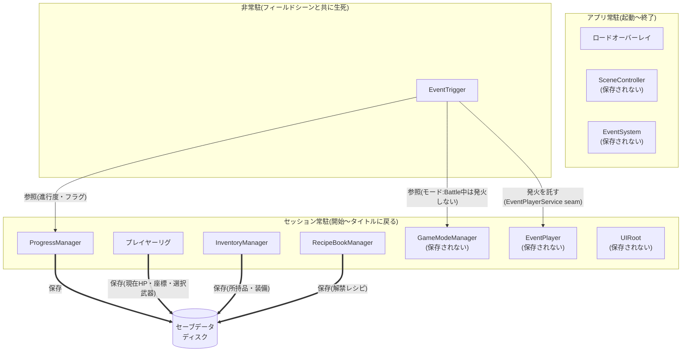

# ゲーム仕様書

ゲームに実装する機能の **仕様(要件・設計)** をまとめたもの。

---

## 0. プロジェクト前提(確定事項)

各機能のスコープ・規模を判断する際の共通の基準。

| 項目                    | 内容                                                                 |
| ----------------------- | -------------------------------------------------------------------- |
| 戦闘方式                | **リアルタイムアクション** |
| 戦闘形式                | **1戦闘につき敵は1体のみ**                                                       |
| フィールド上のアイテム  | 取得可能なアイテムは **キラキラとしたエフェクト** を伴って地面に配置される           |
| セーブ / 死亡時挙動     | **マニュアルセーブのみ**(自動セーブなし)・**単一スロット**上書き・**フィールドでの移動中のみ**(戦闘モード中・会話UI表示中は不可)発動。死亡時は直近セーブから再開。 |

---

## 1. プレイヤーステータス

プレイヤーの最終ステータスは **素の値 + 装備の補正 + 武器の補正** の合算で出す。

| 層 | 元 | いつ再計算 |
| -- | -- | ---------- |
| **素の値**(base) | 装備を何もつけていない値 | 固定 |
| **装備の補正** | 装備品(最大3)の `攻撃%`/`防御%`/`最大HP%`/`会心` 等(下記「アイテムカテゴリと付与ステータス」) | **装備品の変更時** |
| **武器の補正** | **選択中の武器(1)** の固定ステータス | **武器の切替時** |

```
最終ステータス = 素の値 + 装備の補正 + 武器の補正
                    ↑装備品変更・武器切替で更新
```

> **主人公の素の値(base・装備なし)**: 攻撃力 **2000** / 防御力 **500** / 最大HP **1000** / 会心率 **0%** / 会心ダメージ **0%**。

### 1.1 武器3本の固定ステータス

**主人公が最初から3本(剣・弓・ハンマー)を所持**し、入手・調合はしない。**装備の概念はなく**、フィールド上で **即時に1本を選択して切り替える**(画面遷移なし・移動中/戦闘中とも。装備品3つ枠とは別)。**選択中の1本の補正だけ**が最終ステータスに乗る。各武器の補正は下記2つで固定:

| 武器 | 固定ステータス(2つ) |
| ---- | -------------------- |
| 剣 | 攻撃% **+25%** ＋ 会心ダメージ **+50%** |
| 弓 | 攻撃% **+25%** ＋ 会心率 **+50%** |
| ハンマー | 会心率 **+50%** ＋ 会心ダメージ **+50%** |

> 上の値は **平均ダメージ(= 攻撃力 ×(1 + 会心率 × 会心ダメージ))が3本とも等価**になるよう設定(素の会心率0/会心ダメージ0・攻撃力2000で計算 → いずれも平均 **2500**)。条件は `攻撃% = 会心率 × 会心ダメージ`。

---

## 2. インベントリ / アイテム / 装備

> 食材・装備品・大事なもの を **共通のインベントリ** で管理する。容量は事実上無制限。**武器はインベントリ管理の対象外**。
> インベントリUIは **所持品の閲覧**(タブ: **装備品 / 食材 / 大事なもの**)。

| 機能         | 内容                                                       |
| ------------ | ---------------------------------------------------------- |
| アイテム定義 | 種別・効果・アイコンなどのマスタデータ(装備品 / 食材 / 大事なもの。武器は対象外) |
| 保持・追加・削除 | 取得・装備解除・調合などによる出し入れ                 |
| 装備         | 装備品によるステータス補正をプレイヤーに反映 |
| 拾得         | フィールド上のアイテムを取得しインベントリへ追加 |

### 2.1 アイテムカテゴリと付与ステータス

アイテムは **装備品 / 食材 / 大事なもの** の3カテゴリ。うち付与ステータスを持つのは次の2つ:

| カテゴリ | 装備数上限 | 付与ステータス候補 | 付与数 |
| -------- | ---------- | ------------------ | ------ |
| 装備品   | 最大3つ    | 攻撃% / 防御% / 移動速度% / 攻撃速度% / 会心ダメージ / 会心率 / 最大HP% | 最大2つ |
| 食材     | -          | **HP即時回復** のみ | 1つ |

> **HP関連の補足**: 装備品・武器の「最大HP%」は **最大HP値を増加** させる継続バフ。食材の「HP即時回復」は **使用時に現在HPを回復** する即時効果。
> **食材のHP即時回復量は固定値**（全食材共通・素材の組み合わせに依らず一定）: **合成前 = 最大HPの20% / 合成後 = 最大HPの50%** を回復する。

> **大事なもの(キーアイテム)の補足**: ストーリー進行用のアイテム。3カテゴリの1つだが、ステータス付与・装備・調合・使用の対象外で、**付与ステータスを持つ上記2カテゴリ(装備品・食材)には含まれない**。インベントリUIで **閲覧のみ** できる。

### 2.2 食材の使用ルール

食材を使う導線は2つ。**戦闘中(Battle)は常時表示の即時食材使用UI(セット済み最大3つ)だけ**、**移動中(Field)はそれに加えてインベントリの食材タブからも所持食材を使用できる**(戦闘中はインベントリを開けない)。会話UI表示中など操作不能なイベント中はどちらも使用不可。

| 項目             | 内容                                                                                       |
| ---------------- | ------------------------------------------------------------------------------------------ |
| 即時食材使用UI   | **戦闘前にキャラクターUIの即時使用食材タブで最大3つセット**した食材を、**移動中・戦闘中とも常時表示の即時食材使用UI** からクイック使用する(モードで変わらない) |
| インベントリUI   | **移動中は食材タブから所持食材を使用できる**(即時UIのセット3つに限らず所持食材すべてが対象)。**戦闘中はインベントリを開けないため使用不可**(即時食材使用UIのみ)。閲覧はどちらでも可 |
| 効果適用         | **HP即時回復をその場で適用**(食材の効果はHP回復のみ。時間制限バフは持たない)                |
| 一時停止         | 移動中・戦闘中とも食材使用で一時停止しない(即時回復のみ・時間は止まらない)                 |

### 2.3 調合システム

> 既存のアイテムを掛け合わせて新たなアイテムを生成する仕組み。
> ステータスはカテゴリで扱いが分かれる: **装備品は端末で確率的にロール**(同じ素材ペアでも個体差が出る)、**食材は固定値**。アーキテクチャは [CraftingArchitecture.md](./CraftingArchitecture.md)、ステータス算出は [CraftingStatAlgorithm.md](./CraftingStatAlgorithm.md) を参照。
>
> **調合UIは「自由調合」＋「レシピ帳」の2面**: 自由に2素材を選んで実行して**新しい組み合わせを発見**し、成功したレシピは**レシピ一覧に解禁**されて以降ワンタップで再調合できる。**解禁状態はプレイごとの状態**として `RecipeBookManager`(セッション常駐)が保持し、手動セーブで保存・続きからで復元・新規開始でまっさら。カタログ本体は読み取り専用で解禁状態を持たない。

---

## 3. シーン

### 3.1 シーン一覧

| シーン           | 内容                                                                  |
| ---------------- | --------------------------------------------------------------------- |
| タイトルシーン   | ゲーム起動直後の画面。新規開始 / 続きから への入口              |
| フィールドシーン(複数) | 3Dフィールドでの探索・移動・戦闘を行う **エリアごとのシーン**(例: 町 / 洞窟 / 森 …)。**常に1つだけロード**され互いに相互排他で、エリアの**出入口でシーン遷移**する(間にロードオーバーレイ) |

> **ロード画面はシーンではなく UI オーバーレイで実装する**。

---

## 4. 進行管理

進行度(整数1つ)で物語の進行を管理し(分岐はフラグで併用)、**エリア侵入時に条件付きでイベント(会話・戦闘)を発火**する。物語班が `events.json` を手書きし、システム班が Importer で取り込む。**取り込み〜トリガー設置〜再生の実装手順・フローは [EventImplementation.md](./EventImplementation.md)。**

| 機能               | 内容                                                       |
| ------------------ | ---------------------------------------------------------- |
| 進行度・フラグ管理 | メイン進行度とフラグの保持・更新(`ProgressManager`)        |
| イベントトリガー   | 位置・進行度・フラグなどの条件によるイベント発火 |

**`EventDefinition`(イベントの実体)**: イベント = **発火条件 + 会話ステップ列 + `nextProgress`(終了時に進める進行度)** を1つにまとめた定義(Unity の ScriptableObject)。物語班の `events.json` を Importer が取り込んで生成する。各フィールドの書式は [CharactersAndEvents.md](./CharactersAndEvents.md)、生成・配置・実行の手順は [EventImplementation.md](./EventImplementation.md)。

### 4.1 進行度とフラグ

メインストーリーの進行は **進行度(整数1つ)** で表す(例: 0→1→2…)。分岐はフラグで持つ(後述)。

- 進行度さえ保存すればどこからでも再開でき、デバッグも書き換えるだけ
- 「ボスを倒したか」のような状態も進行度で判定する
- **どのイベントもちょうど1回だけ発火する**(繰り返し発火するイベントは作らない)
- 分岐は進行度と `flag` で表す

進行度に畳めない分岐は **フラグ(key → 値)** で併用する。プレイヤーの選択(2択以上)など、進行度の大小では表せない独立した状態を保存する(例: `girl_choice = "together"`)。選択は会話中の `choice` ステップで書き込み、`flag` 条件で後のイベントを分岐させる。

---

## 5. UI / オーバーレイ

UI はシーン上に重ねて表示する **オーバーレイ** を指す。**HUD・右上アイコンバー・即時食材使用UI・武器切替UIは全モードで常駐**する。モードで変わるのは **右上アイコンバー(HP の HUD とは別 Canvas の常駐ナビ)の表示/非表示だけ**(戦闘モードでは非表示。HP の HUD・即時食材使用UI・武器切替UIは常時表示)。Prefab化・Canvas構成・`UiRouter` の実装は [UIImplementation.md](./UIImplementation.md)。

**全モード常駐(自動表示)**

| UI               | 表示元                                | 内容                                                                                   |
| ---------------- | ------------------------------------- | -------------------------------------------------------------------------------------- |
| HUD              | フィールドシーン                            | **HP表示のみ**を常時表示。**全モードで表示内容は同一** |
| 右上アイコンバー   | フィールドシーン                            | キャラクターUI / インベントリUI / セーブUI への円形アイコン遷移ボタン。**HP の HUD とは別 Canvas** の常駐ナビで、**移動中のみ表示・戦闘モード中は非表示** |
| 即時食材使用UI       | フィールドシーン                            | 食材のクイック使用UI。**セット済みの最大3つ**を使用する。**移動中・戦闘中とも常時表示** |
| 武器切替UI       | フィールドシーン                            | 選択中の武器を切り替えるインラインHUD。**画面遷移なし**でその場で所持3本から1本を選ぶ(閲覧はキャラクターUIの武器タブ・入手/調合なし)。**移動中・戦闘中とも常時表示** |

**操作で開くUI(移動中のみ。キャラ / インベ / セーブ は右上アイコンバー、調合は調合場所から)**

| UI               | 表示元                                | 内容                                                                                   |
| ---------------- | ------------------------------------- | -------------------------------------------------------------------------------------- |
| キャラクターUI   | フィールドシーンHUDから                     | **主人公のみ**。タブで操作(ステータス / 武器 / 装備品 / 即時使用食材)。**ステータスタブでステータス確認**、**装備品タブで装備品の装備変更**(3カラム: カテゴリ/モデル/詳細)、**武器タブで所持する3本の武器を閲覧**(装備操作はなし。実際の切替はフィールド上の武器切替UIで即時に行う＝移動中・戦闘中とも)、**即時使用食材タブで即時使用食材(最大3つ)のセット**(即時食材使用UIの中身を決める)を行う |
| インベントリUI   | フィールドシーンHUDから                     | 所持品の閲覧と、**移動中の食材使用**(食材タブから所持食材を使える。戦闘中はインベントリを開けないため不可)。タブで操作(**装備品 / 食材 / 大事なもの**。武器タブは持たない)。装備変更・即時使用食材のセットはキャラクターUIから |
| セーブUI         | フィールドシーンHUDから                     | **マニュアルセーブの確認ダイアログ**(画面遷移ではなくフィールドを暗転させる半透明オーバーレイ。「ここまでの変更をセーブしますか？」+ はい/いいえ。|
| 調合UI           | フィールドシーン(**調合場所でのみ**)       | 素材の選択・調合実行(**=確定・キャンセル不可**)・**結果の事後表示**(リロール防止のためプレビューして確定する方式は採らない。[CraftingArchitecture.md](./CraftingArchitecture.md)) |

**全モード共通**

| UI               | 表示元                                | 内容                                                                                   |
| ---------------- | ------------------------------------- | -------------------------------------------------------------------------------------- |
| 会話UI           | フィールドシーン                            | 戦闘前後やイベント時にオーバーレイ表示される会話演出。**画面下に会話ウィンドウ、上半分に2Dキャラクター立ち絵** を配置 |
| ロードオーバーレイ | 全シーン共通(常駐 Canvas)           | シーン遷移中の待ち時間を埋める表示。背景アートを含む |

---

## 6. 常駐アーキテクチャ

シーンのロード(タイトル ⇔ フィールドシーン、フィールドシーン間のエリア遷移、セーブのロード)をまたいで生き続けるものの索引。いずれも `DontDestroyOnLoad` で常駐させるが、**寿命の境界で2種類に分ける**:

- **アプリ常駐** … アプリ起動〜終了。タイトルに戻っても生き続け、プレイをまたいで**使い回す**。**プレイごとの状態は持たない**
- **セッション常駐** … 新規開始/続きから〜タイトルに戻るまで。フィールド間のエリア遷移はまたぐが、**タイトルに戻る時に破棄し、次の開始で作り直す**。**プレイごとの状態を持つ**(新規開始でまっさらになるのが自動で手に入る)

| 管理システム | 種類 | 役割 |
| --- | --- | --- |
| ロードオーバーレイ(常駐 Canvas) | アプリ常駐 | シーン遷移中のロード表示。全ロードを覆う土台 |
| `SceneController`(シーン遷移役) | アプリ常駐 | シーンのロード/アンロード・ロードオーバーレイの出し入れ・到着スポーン配置。タイトル ⇔ フィールド遷移そのものを実行するため終了まで生きる。 |
| `EventSystem`(UI入力の司令塔) | アプリ常駐 | 表示中の UI にクリック/タップを届ける係(UI を出す役ではない) |
| `ProgressManager` | セッション常駐 | メイン進行度・フラグの保持 |
| `GameModeManager` | セッション常駐 | Field / Battle 状態の保持・変化通知 |
| `InventoryManager`(所持品) | セッション常駐 | 所持アイテムの実行時保持(個体＋ロール済みステータス)。装備品の装備(`equipped`)はここの個体を参照。ディスクへは**手動セーブ時のみ**全書き。プレイヤーリグには載せない。**武器は `InventoryManager` ではなくプレイヤーリグの `WeaponManager` が管理** |
| `RecipeBookManager`(レシピ解禁) | セッション常駐 | 解禁(発見)済みレシピの保持。自由調合で成功した組み合わせを解禁し、レシピ一覧に並べる。進行度・所持品とは別概念として独立。 |
| `EventPlayer`(会話イベント指揮役) | セッション常駐 | 会話イベントを頭から再生し切る指揮役。状態は持たず**保存されない** |
| `UIRoot`(UIレイヤー) | セッション常駐 | HUD・右上アイコンバー・即時食材使用UI・武器切替UI・各パネル(キャラ/インベ/セーブ/調合)・会話UI を束ねる |
| プレイヤーリグ(プレイヤーモデル + `PlayerStatus` + 武器モデル + `WeaponManager` + アニメーション + メインカメラ) | セッション常駐 | プレイヤーの**実体と実行時状態**(現在HP・最終ステータス・選択中の武器)を持ち、エリア遷移をまたいで持ち越す **唯一のシーン実体** |


