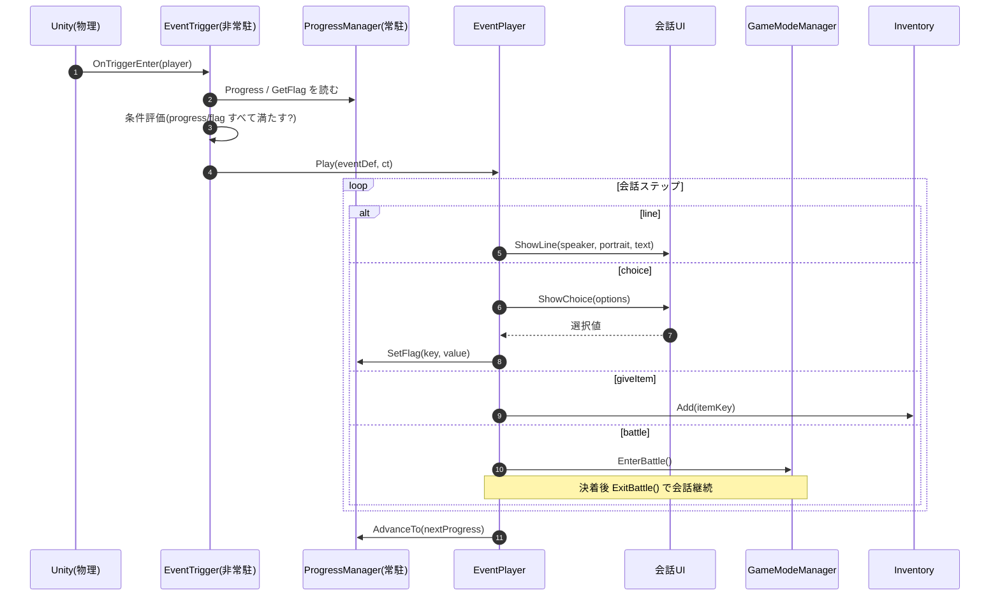

# ストーリー進行システム

進行度(整数1つ)で物語の進行を管理し(分岐はフラグで併用)、**エリア侵入時に条件付きでイベント(会話・戦闘)を発火**する。
物語班が `events.json` を手書きし、システム班が Importer で取り込む。

```
[events.json]  物語班がテキストエディタで直接記述
   ↓ 取り込み + 検証
[Importer]  Unityエディタ拡張で JSON → EventDefinition(.asset を生成)
   ↓ システム班がシーンのトリガーに .asset をアサイン
[ランタイム]  ProgressManager + EventTrigger が進行度・条件でイベントを発火
```

**分業**: 物語班 = `events.json` を書く / 視覚班・音響班 = 立ち絵・BGM を用意 / システム班 = 敵データ・データモデル・カタログ登録・Importer・ランタイム。境界を JSON に置くことで作業が干渉しない。

---

## 進行度とフラグ

メインストーリーの進行は **進行度(整数1つ)** で表す(例: 0→1→2…)。分岐はフラグで持つ(後述)。

- 進行度さえ保存すればどこからでも再開でき、デバッグも書き換えるだけ
- 「ボスを倒したか」のような状態も進行度で判定する(勝たないと進行度が進まない。例: 進行度6以上なら撃破済み)
- **アイテム所持はイベント発火条件に使わない**。分岐は進行度と `flag` で表す(`giveItem` は大事なものを渡すだけで、出し分けには使わない)

進行度に畳めない分岐は **フラグ(key → 値)** で併用する。プレイヤーの選択(2択以上)など、進行度の大小では表せない独立した状態を保存する(例: `girl_choice = "together"`)。選択は会話中の `choice` ステップで書き込み、`flag` 条件で後のイベントを分岐させる。

実装は次の **3つのコンポーネント**(`Features/Core/Scripts/EventSystem/`):

- **`ProgressManager`**(常駐)… 進行度・フラグを**保持**し、条件判定に読ませる。状態を持つだけで、イベントの中身は知らない
- **`EventTrigger`**(非常駐)… シーン上のトリガーに置く。プレイヤー侵入を検知し、条件を満たしたら**イベントの発火を決める**(1リクエストを受けるルーター役)
- **`EventPlayer`**(非常駐)… `EventTrigger` に発火を託され、**1本の会話イベントを頭から順に再生し切る指揮役**。`line`→会話UI、`choice`→`ProgressManager.SetFlag()`、`battle`→`GameModeManager.EnterBattle()`、終了時→`ProgressManager.AdvanceTo()` と、各ステップで他システムを叩くのはこの役(1リクエストのハンドラ役)

`EventTrigger`・`EventPlayer` はシーン上で動く非常駐で、会話が終われば役目を終える。**3者の呼び出し関係は後述の「関数レベルのフロー」** にまとめる。`EnterBattle()`/`AdvanceTo()` を叩く「**進行側**」とは、この `EventPlayer` を指す。

---

## イベント(EventDefinition)

イベント = **条件** + **会話** + **終了時に進める進行度**。会話はイベント内に直接持つ(1イベント1会話)。ScriptableObject で表す。

**発火**: プレイヤーが対象トリガーに侵入し、条件を **すべて満たす** と発火する。どのトリガー(エリア)でどのイベントが発火するかは、システム班がシーン上のトリガーにイベントの `id` を対応させて決める(座標は JSON に書かない)。

発火条件は固定の2タイプ(物語班は選んで値を埋める)。

| 条件タイプ | 意味 |
| ---------- | ---- |
| `progress` | メイン進行度が指定値以上 |
| `flag`     | 指定フラグが指定値(`choice` で書いた分岐結果) |

**会話ステップ**: 会話は4種類のステップの並び。任意の順に挟める。

| ステップ | 内容 |
| -------- | ---- |
| `line` | セリフ(話者名・立ち絵キー・テキスト)。立ち絵はセリフごとに切替可(表情差分) |
| `battle` | 戦闘(敵キー)。戦闘が終わると会話の続きから再生 |
| `giveItem` | アイテム付与(アイテムキー)。ストーリー用の **大事なもの(キーアイテム)** 等を渡す。渡す/渡さないの分岐は `choice` → `flag` で表す |
| `choice` | 2択以上を提示し、選んだ値をフラグに書く。別イベントの `flag` 条件と対になる |

- **戦闘は必ず会話の途中**(先頭・末尾は必ず `line`)。戦闘が単独・末尾にならない
- 勝利 → 会話の続き → 終了時に進行度UP / 敗北 → 直近セーブから再開(`GameSystems.md` のリスポーン仕様)
- 戦闘は勝敗を記録しない(状態は進行度で判定する)

> 戦闘は **同じフィールドシーン上の戦闘モード**(別シーンへは遷移しない)。

---

## シーンへのトリガー設置(システム班の手順)

座標は JSON に書かない。**イベントが起こる場所は、システム班がシーン上に手で置く**。Importer が生成した `EventDefinition`(`.asset`)を、シーン上のトリガーに結び付けて初めて発火する。

| 手順 | やること |
|---|---|
| 1 | フィールドシーンの発火させたい位置に **空の GameObject** を作る |
| 2 | **Collider を付け `Is Trigger = ON`**(プレイヤー侵入を検知する範囲。大きさ・位置でエリアを決める) |
| 3 | **`EventTrigger` をアタッチ** |
| 4 | `EventTrigger` の `[SerializeField] EventDefinition` に、**Importer が生成した `.asset`** をアサイン |
| 5 | プレイヤー側に Rigidbody/レイヤー等、`OnTriggerEnter` が飛ぶ前提を満たす設定を確認 |

- 発火するか(進行度・フラグ条件)は `.asset`(ScriptableObject)側が持つ。トリガーは **場所と範囲だけ**を担当する。
- 1つのイベントを複数箇所で発火させたいなら、同じ `.asset` を複数のトリガーにアサインしてよい。

---

## 関数レベルのフロー

- `EventTrigger` は Unity がコライダ侵入で叩く。条件を満たせば `EventPlayer.Play()` を呼ぶだけ。
- `EventPlayer` が会話ステップを順に実行し、各ステップで他システム（会話UI・`GameModeManager`・`Inventory`・`ProgressManager`）を叩く。ここが他システムを**指揮する層**（会話→戦闘→会話…）。
- `ProgressManager` は**状態を持つだけ**。進行度・フラグを読ませ／書かせ、変わったら通知する。



---

## カタログ(キー参照)

立ち絵・BGM・敵の **実体は各班が用意** し、システム班がキーを登録する。物語班は `events.json` に **キーを書くだけ**で、実ファイルには触らない。カタログ = **キー文字列 ⇔ ゲーム内アセット** の対応表。

```
[各班] 立ち絵PNG/BGM/敵データを用意
   → [システム班] カタログに登録(キー ⇔ 実体)  例: girl_smile → girl_smile.png(Sprite)
   → [物語班] events.json にカタログのキーを書き写す
```

システム班は有効キー一覧(立ち絵/BGM/敵/アイテム)を物語班に共有する。手書きなので打ち間違いは前提とし、**存在しないキーは Importer が弾く**。

> ここでいうカタログは `CraftingArchitecture.md` の「結果カタログ(同梱)」とは**別物**。混同しない。

### 定義(どう実体化するか)

カタログは **カテゴリごとに 1 つの ScriptableObject アセット**として持つ。中身は「キー → 実体」の並び。1本の `.asset` を **Importer(エディタ)からもランタイムからも**参照でき、有効キー一覧の共有もこのアセットを見れば済む。

```csharp
[CreateAssetMenu(menuName = "Scenario/PortraitCatalog")]
public sealed class PortraitCatalog : ScriptableObject
{
    [Serializable] public struct Entry { public string key; public Sprite sprite; }
    [SerializeField] Entry[] entries;                 // 例: { "girl_smile", girl_smile.png }
    public bool TryGet(string key, out Sprite sprite); // ランタイム解決 & Importer 検証で共用
}
```

- **敵・アイテムはカタログを新設しない**。既に id 付きのデータ定義(`EnemyData` / `ItemData`)を持つので、その一覧を id で引くのがカタログの役目。新規に要るのは実質 **立ち絵・BGM** の2つ。
- 登録は**手入力しない**。データ SO を規約フォルダに置き `id` をキーにする運用にして、**エディタ拡張がフォルダを走査してカタログを自動生成**する(有効キー一覧の共有も自動化できる)。

### キーと実ファイルの紐づけ方

紐づけの実体は**パス文字列ではなく参照(GUID)**。Inspector にドラッグすると `.asset` 内にアセットの GUID が書かれるので、ファイルを移動・リネームしても切れない。**音・画像は1段、敵は2段**で構造が違う。

| 種別 | 紐づけ | 段数 |
| ---- | ------ | ---- |
| 立ち絵 | `girl_smile` → `Sprite`(PNG取り込み) | 1段 |
| BGM | `battle_theme` → `AudioClip` | 1段 |
| アイテム | `old_key` → **同梱アイテム定義(ローカル)** | 1段 |
| 敵 | `slime_a` → `EnemyData`(ScriptableObject) → **Prefab(3Dモデル一式)** | 2段 |

敵は単一ファイルではない。3Dモデル(`.fbx`)+ マテリアル + アニメ + コンポーネントを **Prefab に合成**し、`EnemyData` がその Prefab への参照とステータスを持つ。だから `enemyKey → EnemyData → Prefab` の2段解決になる。

> **アイテムの実体定義は Story 側で持たない。**`giveItem` が渡すのは大事なもの(キーアイテム)= 同梱アイテムで、その定義(名前・画像・説明・カテゴリ)は**ローカル同梱データ**にある。アイテム全体の持ち方(素材・合成結果とも同梱 / 装備品ステータスは端末でロールして動的)は [CraftingArchitecture.md](./CraftingArchitecture.md) が正本で、Story は **キーで参照するだけ**。

> アセットの持ち方は **直接参照(SerializeField・GUID)** が既定。立ち絵/敵が大量になり常時ロードが重いなら **Addressables(アドレス=キーで非同期ロード)** に寄せる。キー方式は Addressables とも相性が良い。

---

## events.json(正本フォーマット)

物語班が手書きする `events.json` の正本フォーマット・Importer の検証ルール・登場人物の立ち絵(`portrait`)キーのカタログは `CharactersAndEvents.md` にまとめる。

---

## Importer

`events.json` を取り込む Importer はエディタ拡張として `Features/Scenario/` 配下に実装する。検証内容は `CharactersAndEvents.md` を参照。
