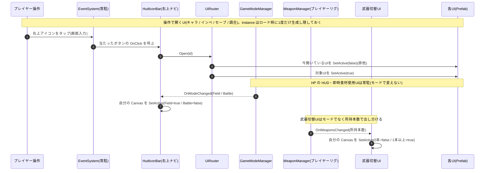

# UI の実装(手順とフロー)

UI の **仕様**(どんな UI がいつ出るか・呼び出しの設計)は [Specification.md](./Specification.md)「UI / オーバーレイ」。ここでは各 UI を Unity 上でどう Prefab 化し、どう出し分けるか(手順とフロー)をまとめる。

---

## 1. UI を Prefab 化して配線する(Unity Editor でやること)

**アセット作成 → コード → 最後に Inspector で配線** の順で進める(参照を張れるのは実体が揃ってからなので、紐づけは最後。この順番は Player / Enemy の実装でも同じ)。

**① UI を Prefab 化する**
- **1つの UI = 1つの Prefab**(ルートに `Canvas` を持つ)。中身(ボタン・タブ・テキスト)ごと Prefab に合成し、`.prefab` として Project に置く。シーンには埋め込まない。

**② 残りの手作業 = 各 UI の中身を差し込む**
- **Title シーンで**生成器が組む `UIRoot` は各 UI が **空 Canvas の骨組み**(HUD の HP・即時食材使用UI・武器切替UI・会話UI)。班ごとの実 UI(Prefab/中身)を該当 Canvas に入れる。参照張りは **ドラッグ&ドロップ**。

### 確認(Play)
- Title →「新規開始」→ **HUD**・**即時食材使用UI** が出て、右上アイコンバーが表示される(**武器切替UIは武器0本なので非表示**。イベントで最初の1本を入手すると出る)
- 右上アイコンから キャラ / インベ / セーブ を開くと **常に1つだけ**開く(別のを開くと前のが閉じる=排他)
- 戦闘モードに入ると **右上アイコンバーだけが消える**(セーブ等を開けない)。HUD本体・即時食材使用UI は表示内容そのままで残る
- 戦闘モードを抜けると **右上アイコンバーが戻る**
- シーン遷移中は **ロードオーバーレイ** が出て、完了で消える

---

## 2. 関数レベルのフロー(UiRouter の排他表示 / HudIconBar のモード反応)

