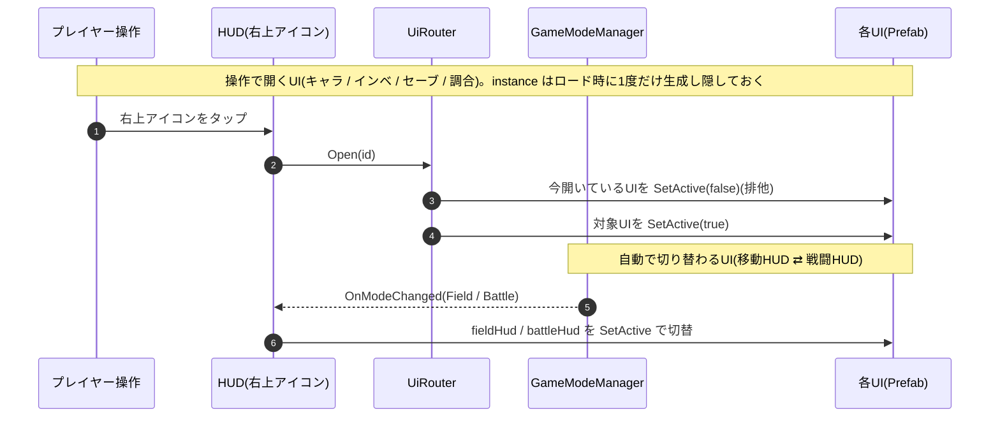

# UI の実装(手順とフロー)

UI の **仕様**(どんな UI がいつ出るか・呼び出しの設計)は [Specification.md](./Specification.md)「UI / オーバーレイ」。ここでは各 UI を Unity 上でどう Prefab 化し、どう出し分けるか(手順とフロー)をまとめる。

> **実装状況(2026-07 時点)**:
> - ✅ **実装済み**:ロードオーバーレイ(`LoadingOverlayController`・Title に常駐)/ セーブUI の「はい」→ `SaveService.Save()` 配線 / HUD・各パネルの生成(`SetupInitialScenes` が直接生成・配線)
> - ⏳ **未実装(この文書は設計)**:`UiRouter`(排他制御)/ HUD のモード自動切替 / 会話UI(`IDialogueView`)/ 各UIの Prefab 化
> - 現状 HUD は `HUDController` が右上ボタン↔パネルを子インデックスで対応付け `UIPanelStub.Open` を直接呼ぶ簡易版(排他制御なし)。`UiRouter`(排他制御)による設計へ今後移行する。

---

## 1. UI を Prefab 化して配線する(Unity Editor でやること)

**アセット作成 → コード → 最後に Inspector で配線** の順で進める(参照を張れるのは実体が揃ってからなので、紐づけは最後。この順番は Player / Enemy の実装でも同じ)。

**① UI を Prefab 化する**
- **1つの UI = 1つの Prefab**(ルートに `Canvas` を持つ)。中身(ボタン・タブ・テキスト)ごと Prefab に合成し、`.prefab` として Project に置く。シーンには埋め込まない。
- HUD・会話UI など**シーン中に出す UI** は、シーン側(または UI 管理オブジェクト)が Prefab を `Instantiate` して重ねる。開閉は GameObject の表示/非表示で行い、シーン遷移はしない。
- **ロードオーバーレイだけは `DontDestroyOnLoad` の常駐 Canvas**(アプリ常駐 → [Specification.md](./Specification.md)「常駐アーキテクチャ」)。全シーンのロードを上から覆うため、他の UI より前面のソート順に置く。

| UI | Prefab | 出し方 |
| --- | --- | --- |
| 移動HUD / 戦闘HUD / 戦闘食材UI | 各1つ | モード連動で自動切替(§2) |
| キャラクター / インベントリ / セーブ / 調合 | 各1つ | `UiRouter.Open(id)` で排他表示(§2) |
| 会話UI | 1つ | `EventPlayer` が表示/非表示 |
| ロードオーバーレイ | 1つ(常駐) | `SceneManager.LoadSceneAsync` の進捗に同期 |

**② 切替役スクリプトを用意して載せる**
- `UiRouter`(操作で開く UI の排他制御)/ HUD の切替役スクリプトを用意し(`[SerializeField]` スロットを持つ)、シーン上のオブジェクトにアタッチする。全体の流れは §2。

**③ Inspector で Prefab をスロットに配線する**
- ①の各 UI Prefab を、②のスクリプトのスロットへ **ドラッグ&ドロップ** で紐づける(GUID 参照。リネーム・移動に強く、未割当は `None` と出て目視できる ― `Resources.Load` の文字列指定より安全。理由は [PlayerImplementation.md](./PlayerImplementation.md))。

### 確認(Play)
- Title →「はじめる」→ **移動HUD** が出て、右上アイコンが表示される
- 右上アイコンから キャラ / インベ / セーブ を開くと **常に1つだけ**開く(別のを開くと前のが閉じる=排他)※`UiRouter` 移行後
- 戦闘モードに入ると 移動HUD が **戦闘HUD・戦闘食材UI に置き換わり**、右上アイコンが消える(セーブ等を開けない)※自動切替 移行後
- シーン遷移中は **ロードオーバーレイ** が出て、完了で消える

---

## 2. 関数レベルのフロー(UiRouter / HUD 切替)

UI の出方は2系統。**操作で開く UI** は `UiRouter.Open(id)` の1本で排他表示し、**自動で出る UI**(HUD)は `GameModeManager.OnModeChanged` に連動して切り替わる。会話UI は `EventPlayer` が、ロードオーバーレイは `SceneController` が出し入れする。

